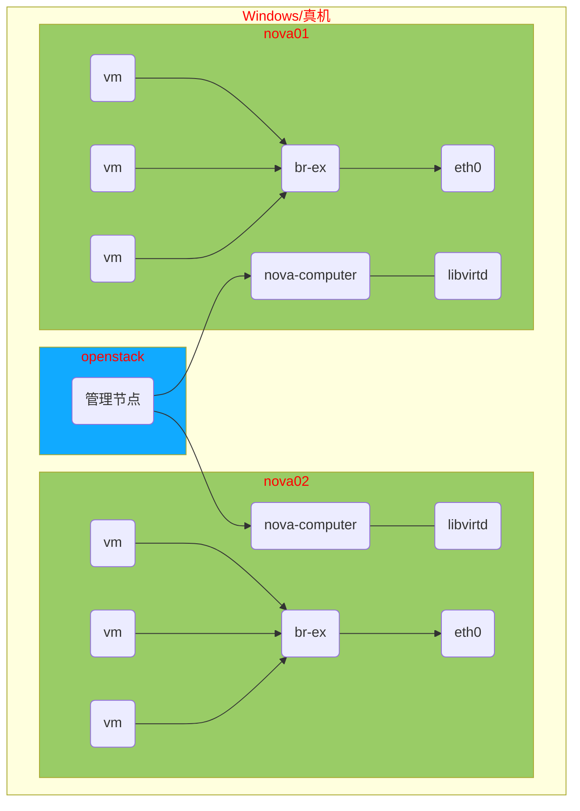

# nova02 安装

## openstack 实验架构图例


## openstack系统环境安装配置

```shell
[root@nova02 ~]# vim /etc/selinux/config
# 修改 SELINUX=disabled
[root@nova02 ~]# yum -y remove firewalld-*
[root@nova02 ~]# reboot
# 重启后验证
[root@nova02 ~]# sestatus 
SELinux status:                 disabled
[root@nova02 ~]# rpm -qa |grep -i firewalld
[root@nova02 ~]# 
```

卸载 NetworkManager

```shell
[root@nova02 ~]# systemctl stop NetworkManager
[root@nova02 ~]# yum remove -y NetworkManager
[root@nova02 ~]# systemctl enable --now network
```

网卡配置文件

```shell
[root@nova02 ~]# vim /etc/sysconfig/network-scripts/ifcfg-eth0
# Generated by dracut initrd
DEVICE="eth0"
ONBOOT="yes"
IPV6INIT="no"
IPV4_FAILURE_FATAL="no"
NM_CONTROLLED="no"
TYPE="Ethernet"
BOOTPROTO="static"
IPADDR="192.168.1.12"
NETMASK="255.255.255.0"
GATEWAY="192.168.1.254"
```

#### Yum安装源配置

确认软件包总数是 <font color=#ff0000>10670</font>

```shell
[root@nova02 ~]# vim /etc/yum.repos.d/openstack.repo 
[local_extras]
name=CentOS-$releasever - Extras
baseurl="ftp://192.168.1.250/extras"
enabled=1
gpgcheck=0

[local_openstack]
name=CentOS-$releasever - OpenStack
baseurl="ftp://192.168.1.250/openstack/rhel-7-server-openstack-10-rpms"
enabled=1
gpgcheck=0

[local_openstack_devtools]
name=CentOS-$releasever - Openstack devtools
baseurl="ftp://192.168.1.250/openstack/rhel-7-server-openstack-10-devtools-rpms"
enabled=1
gpgcheck=0
[root@nova02 ~]# yum makecache
[root@nova02 ~]# yum repolist
Loaded plugins: fastestmirror
Loading mirror speeds from cached hostfile
repo id                    repo name                           status
CentOS-Base                CentOS-7 - Base                     9,911
local_extras               CentOS-7 - Extras                   76
local_openstack            CentOS-7 - OpenStack                680
local_openstack_devtools   CentOS-7 - Openstack devtools       3
repolist: 10,670
```

#### 时间服务器配置

```shell
[root@nova02 ~]# vim /etc/chrony.conf
# 注释掉所有 server 开头的行，添加
server 192.168.1.250 iburst
[root@nova02 ~]# systemctl restart chronyd
[root@nova02 ~]# chronyc sources -v  # 验证配置 ^* 代表成功
```

#### 主机名与DNS配置

```shell
[root@nova02 ~]# vim /etc/hosts
192.168.1.10    openstack
192.168.1.11    nova01
192.168.1.12    nova02
192.168.1.250   repo
# 删除所有 search 开头的行
[root@nova02 ~]# sed '/^search /d' -i /etc/resolv.conf
```

#### nova虚拟环境安装

```shell
[root@nova02 ~]# yum install -y qemu-kvm libvirt-daemon libvirt-daemon-driver-qemu libvirt-client python-setuptools
[root@nova02 ~]# systemctl enable --now libvirtd
[root@nova02 ~]# virsh version # 验证
```
#### nova02安装

在 openstack 上安装 nova02，修改第一次安装的配置文件，不能重新生成！！！

```shell
[root@openstack ~]# vim answer.ini
98:   CONFIG_COMPUTE_HOSTS=192.168.1.12
102:  CONFIG_NETWORK_HOSTS=192.168.1.12
```
安装过程大约 10 ~ 30 分钟不等

```shell
[root@openstack ~]# packstack --answer-file=answer.ini
```

## web页面登录

修改 apache 配置

```shell
[root@openstack ~]# vim /etc/httpd/conf.d/15-horizon_vhost.conf 
# 在配置文件倒数第三行添加
WSGIApplicationGroup %{GLOBAL}
[root@openstack ~]# systemctl reload httpd
```

浏览器访问 http://192.168.1.10/

# 总结

    Horizon  组件,提供web管理界面
    Keystone 组件,提供集中的认证和授权
    Nova     组件,计算节点创建管理云主机
    Glance   组件,管理云主机镜像
    Swift    组件,存储云使用的对象存储服务
    Neutron  组件,管理云服务的内部、外部网络路由等
    Cinder   组件,管理云主机的存储卷服务


