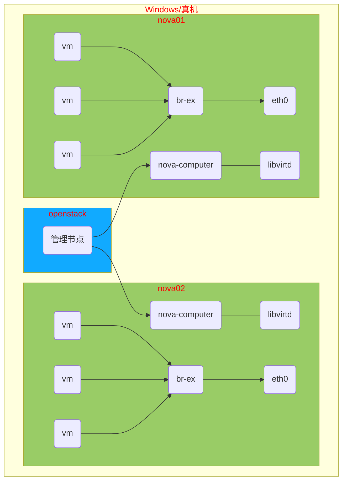

# openstack 安装

## 环境准备
| 主机名称  | IP地址        | 最小资源配置 |
| --------- | ------------- | ------------ |
| openstack | 192.168.1.10  | 2CPU,8G内存  |
| nova01    | 192.168.1.11  | 2CPU,3G内存  |
| nova02    | 192.168.1.12  | 2CPU,3G内存  |
| repo      | 192.168.1.250 | 2CPU,1G内存  |

**上传 RHEL7-extras.iso、RHEL7OSP-10.iso 到功能服务器[repo]**

## 功能服务器安装配置

#### 时间源服务器

```shell
[root@repo ~]# yum install -y chrony
[root@repo ~]# vim /etc/chrony.conf
# 注释掉所有 server 开头的行，添加
server ntp.aliyun.com iburst
bindacqaddress 0.0.0.0
allow 0/0
local stratum 10
[root@repo ~]# systemctl enable chronyd
[root@repo ~]# systemctl restart chronyd
[root@repo ~]# ss -ltun  # 查看 123 端口是否被监听成功
```

#### 网络yum源服务器

```shell
[root@repo ~]# yum install -y vsftpd
[root@repo ~]# systemctl enable --now vsftpd
[root@repo ~]# mkdir -p /var/ftp/{extras,openstack}
[root@repo ~]# cd /var/iso
[root@repo ~]# mount -t iso9660 -o ro,loop RHEL7-extras.iso /var/ftp/extras
[root@repo ~]# mount -t iso9660 -o ro,loop RHEL7OSP-10.iso /var/ftp/openstack
# 在openstack上验证
[root@openstack ~]# curl ftp://192.168.1.250/extras/
[root@openstack ~]# curl ftp://192.168.1.250/openstack/
```

## openstack 实验架构图例



## openstack系统环境安装配置

以下操作，openstack，nova01 都需要做

```shell
[root@openstack ~]# vim /etc/selinux/config
# 修改 SELINUX=disabled
[root@openstack ~]# yum -y remove firewalld-*
[root@openstack ~]# reboot
# 重启后验证
[root@openstack ~]# sestatus 
SELinux status:                 disabled
[root@openstack ~]# rpm -qa |grep -i firewalld
[root@openstack ~]# 
```

卸载 NetworkManager

```shell
[root@openstack ~]# systemctl stop NetworkManager
[root@openstack ~]# yum remove -y NetworkManager
[root@openstack ~]# systemctl enable --now network
```

网卡配置文件注解

* \# Generated by dracut initrd   # 注释
* DEVICE="eth0"                            # 驱动名称，与ifconfig 看到的名称一致
* ONBOOT="yes"	                       # 开机启动
* NM_CONTROLLED="no"            # 不接受 NetworkManager 控制
* TYPE="Ethernet"                         # 类型
* BOOTPROTO="static"                # 协议(dhcp|static|none)
* IPADDR="192.168.1.10"            # IP地址
* NETMASK="255.255.255.0"      # 子网掩码
* GATEWAY="192.168.1.254"      # 默认网关

#### Yum安装源配置

确认软件包总数是 <font color=#ff0000>10670</font>

```shell
[root@openstack ~]# vim /etc/yum.repos.d/openstack.repo 
[local_extras]
name=CentOS-$releasever - Extras
baseurl="ftp://192.168.1.250/extras"
enabled=1
gpgcheck=0

[local_openstack]
name=CentOS-$releasever - OpenStack
baseurl="ftp://192.168.1.250/openstack/rhel-7-server-openstack-10-rpms"
enabled=1
gpgcheck=0

[local_openstack_devtools]
name=CentOS-$releasever - Openstack devtools
baseurl="ftp://192.168.1.250/openstack/rhel-7-server-openstack-10-devtools-rpms"
enabled=1
gpgcheck=0
[root@openstack ~]# yum makecache
[root@openstack ~]# yum repolist
Loaded plugins: fastestmirror
Loading mirror speeds from cached hostfile
repo id                    repo name                           status
CentOS-Base                CentOS-7 - Base                     9,911
local_extras               CentOS-7 - Extras                   76
local_openstack            CentOS-7 - OpenStack                680
local_openstack_devtools   CentOS-7 - Openstack devtools       3
repolist: 10,670
```

#### 时间服务器配置

```shell
[root@openstack ~]# vim /etc/chrony.conf
# 注释掉所有 server 开头的行，添加
server 192.168.1.250 iburst
[root@openstack ~]# systemctl restart chronyd
[root@openstack ~]# chronyc sources -v  # 验证配置 ^* 代表成功
```

#### 主机名与DNS配置

```shell
[root@openstack ~]# vim /etc/hosts
192.168.1.10    openstack
192.168.1.11    nova01
192.168.1.12    nova02
192.168.1.250   repo
# 删除所有 search 开头的行
[root@openstack ~]# sed '/^search /d' -i /etc/resolv.conf
```

#### nova虚拟环境安装

nova01 安装

```shell
[root@nova01 ~]# yum install -y qemu-kvm libvirt-daemon libvirt-daemon-driver-qemu libvirt-client python-setuptools
[root@nova01 ~]# systemctl enable --now libvirtd
[root@nova01 ~]# virsh version # 验证
```

#### packstack工具安装

只需要在 openstack 上安装即可

```shell
[root@openstack ~]# yum install -y python-setuptools openstack-packstack
```

#### openstack安装

使用应答文件安装，只需要在 openstack 上安装即可

```shell
# 创建应答文件
[root@openstack ~]# packstack --gen-answer-file=answer.ini
# 修改应答文件
42:   CONFIG_SWIFT_INSTALL=n                              //存储对象组件
45:   CONFIG_CEILOMETER_INSTALL=n                         //计费模块
49:   CONFIG_AODH_INSTALL=n                               //计费模块
53:   CONFIG_GNOCCHI_INSTALL=n                            //计费模块
75:   CONFIG_NTP_SERVERS=192.168.1.250                    //时间服务器
98:   CONFIG_COMPUTE_HOSTS=192.168.1.11                   //计算节点IP
102:  CONFIG_NETWORK_HOSTS=192.168.1.10,192.168.1.11      //网络节点IP
333:  CONFIG_KEYSTONE_ADMIN_PW=a                          //管理员密码
840:  CONFIG_NEUTRON_ML2_TYPE_DRIVERS=flat,vxlan          //支持协议
910:  CONFIG_NEUTRON_OVS_BRIDGE_MAPPINGS=physnet1:br-ex   //网桥设备
921:  CONFIG_NEUTRON_OVS_BRIDGE_IFACES=br-ex:eth0         //出口网卡
1179: CONFIG_PROVISION_DEMO=n                             //演示模块
```
**<font color=#ff0000>做快照！！！</font>**
**<font color=#ff0000>做快照！！！</font>**
**<font color=#ff0000>做快照！！！</font>**

安装过程大约 10 ~ 30 分钟不等

```shell
[root@openstack ~]# packstack --answer-file=answer.ini
```

## web页面登录

修改 apache 配置

```shell
[root@openstack ~]# vim /etc/httpd/conf.d/15-horizon_vhost.conf 
# 在配置文件倒数第三行添加
WSGIApplicationGroup %{GLOBAL}
[root@openstack ~]# systemctl reload httpd
```

浏览器访问 http://192.168.1.10/

命令行登录openstack

```shell
[root@openstack ~]# openstack user list
Missing value auth-url required for auth plugin password
# 没有登录获取数据失败
[root@openstack ~]# source keystonerc_admin 
[root@openstack ~(keystone_admin)]# openstack user list
+----------------------------------+---------+
| ID                               | Name    |
+----------------------------------+---------+
| 0e5367062de6478a9fe2d0456cb5fddb | nova    |
| 27191744bc6349f5b34822c083f7874e | admin   |
| 803074aab6fe49a19b983d9fbb7322be | glance  |
| cf35dd75778d4479965e2f39771956de | neutron |
| d5f4ffae68e54210a6bb29fba36acaaa | cinder  |
+----------------------------------+---------+
# 登录以后获取数据成功
```
