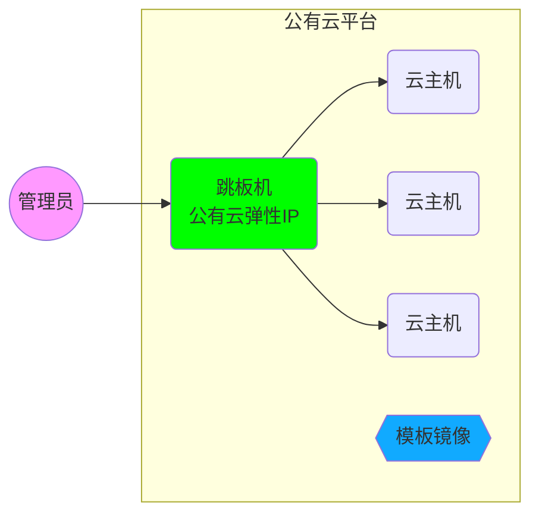
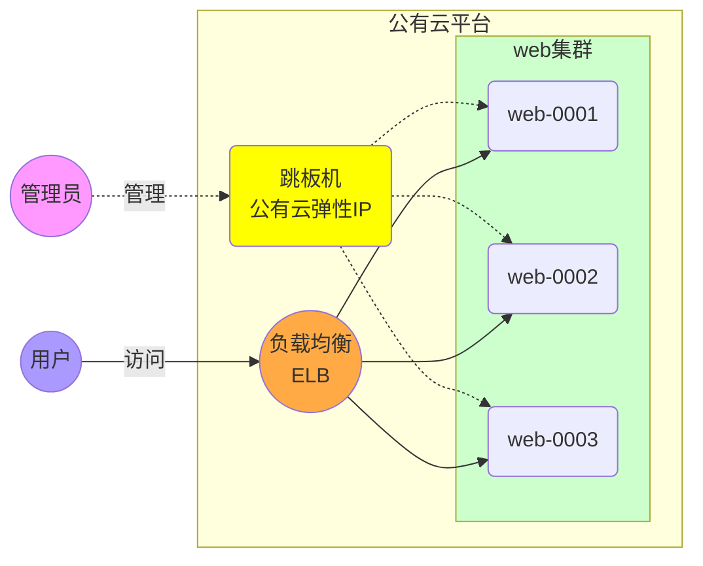

# 公有云 --- 华为云

## 云平台部署管理架构图



## 公有云配置

区域： 同一个区域中的云主机是可以互相连通的，不通区域云主机是不能使用内部网络互相通信的

选择离自己比较近的区域，可以减少网络延时卡顿

华为云yum源配置 https://support.huaweicloud.com/ecs_faq/ecs_faq_1003.html

## 跳板机配置

#### 配置yum源，安装软件包
```shell
[root@ecs-proxy ~]# rm -rf /etc/yum.repos.d/*.repo
[root@ecs-proxy ~]# curl -o /etc/yum.repos.d/CentOS-Base.repo http://mirrors.myhuaweicloud.com/repo/CentOS-Base-7.repo
[root@ecs-proxy ~]# yum clean all
[root@ecs-proxy ~]# yum makecache
[root@ecs-proxy ~]# yum install -y net-tools lftp rsync psmisc vim-enhanced tree vsftpd  bash-completion createrepo lrzsz iproute
[root@ecs-proxy ~]# mkdir /var/ftp/localrepo
[root@ecs-proxy ~]# cd /var/ftp/localrepo
[root@ecs-proxy ~]# createrepo  .
[root@ecs-proxy ~]# createrepo --update . # 更新
[root@ecs-proxy ~]# systemctl enable --now vsftpd
```
#### 优化系统服务
```shell
[root@ecs-proxy ~]# systemctl stop postfix
[root@ecs-proxy ~]# yum remove -y postfix firewalld-*
[root@ecs-proxy ~]# yum install chrony
[root@ecs-proxy ~]# vim /etc/chrony.conf 
# 注释掉 server 开头行，添加下面的配置
server ntp.myhuaweicloud.com minpoll 4 maxpoll 10 iburst
[root@ecs-proxy ~]# systemctl enable --now chronyd
[root@ecs-proxy ~]# chronyc sources -v
# 验证配置结果 ^* 代表成功
[root@ecs-proxy ~]# vim /etc/cloud/cloud.cfg
# manage_etc_hosts: localhost 注释掉这一行
[root@ecs-proxy ~]# reboot
```
#### 安装配置ansible管理主机
```shell
[root@ecs-proxy ~]# cp -a ansible_centos7 /var/ftp/localrepo/ansible
[root@ecs-proxy ~]# cd /var/ftp/localrepo
[root@ecs-proxy ~]# createrepo --update .
[root@ecs-proxy ~]# vim /etc/yum.repos.d/local.repo 
[local_repo]
name=CentOS-$releasever – Localrepo
baseurl=ftp://192.168.1.252/localrepo
enabled=1
gpgcheck=0
[root@ecs-proxy ~]# yum makecache
[root@ecs-proxy ~]# yum install -y ansible
# 去华为云网页下载秘钥，并上传秘钥到跳板机
[root@ecs-proxy ~]# mv luck.pem /root/.ssh/id_rsa
[root@ecs-proxy ~]# chmod 0400 /root/.ssh/id_rsa
```
## 模板镜像配置

<font color=#ff0000>**购买云主机使用秘钥认证**</font>

#### 配置yum源，安装软件包
```shell
[root@ecs-host ~]# passwd root
[root@ecs-host ~]# rm -rf /etc/yum.repos.d/*.repo
[root@ecs-host ~]# curl -o /etc/yum.repos.d/CentOS-Base.repo http://mirrors.myhuaweicloud.com/repo/CentOS-Base-7.repo
[root@ecs-host ~]# vim /etc/yum.repos.d/local.repo 
[local_repo]
name=CentOS-$releasever – Localrepo
baseurl=ftp://192.168.1.252/localrepo
enabled=1
gpgcheck=0
[root@ecs-host ~]# yum clean all
[root@ecs-host ~]# yum makecache
[root@ecs-host ~]# yum repolist
[root@ecs-host ~]# yum install -y net-tools lftp rsync psmisc vim-enhanced tree lrzsz bash-completion lrzsz iproute
```
#### 优化系统服务
```shell
[root@ecs-host ~]# systemctl stop postfix atd polkit tuned
[root@ecs-host ~]# yum remove -y postfix at audit tuned polkit kexec-tools firewalld-*
[root@ecs-host ~]# yum install chrony
[root@ecs-host ~]# chkconfig network on
[root@ecs-host ~]# rm -f /etc/sysconfig/network-scripts/{ifcfg-eth1,ifcfg-eth2,ifcfg-eth3,ifcfg-eth4}
[root@ecs-host ~]# vim /etc/chrony.conf 
# 注释掉 server 开头行，添加下面的配置
server ntp.myhuaweicloud.com minpoll 4 maxpoll 10 iburst
[root@ecs-host ~]# systemctl enable --now chronyd
[root@ecs-host ~]# chronyc sources -v
# 验证配置结果 ^* 代表成功
[root@ecs-host ~]# vim /etc/cloud/cloud.cfg
# manage_etc_hosts: localhost 注释掉这一行
[root@ecs-host ~]# yum clean all 
[root@ecs-host ~]# poweroff
```

关机以后把主机系统盘制作为模板

## 网站云平台部署实战

#### 网站架构图




实验要求：购买3台 1CPU, 1G内存的云主机，部署 apache + php 的网站
​     192.168.1.11   web-0001
​     192.168.1.12   web-0002
​     192.168.1.13   web-0003
​     软件素材在云盘的 public/web_install 目录下

```shell
[root@ecs-proxy ~]# vim /etc/ansible/ansible.cfg
inventory         = /etc/ansible/hosts
host_key_checking = False
[root@ecs-proxy ~]# vim /etc/ansible/hosts
[web]
192.168.1.[11:13]
[root@ecs-proxy ~]# vim web_install.yaml
---
- name: web 集群安装
  hosts: web
  tasks:
  - name: 安装 apache 服务 
    yum:
      name: httpd,php
      state: latest
      update_cache: yes
  - name: 配置 httpd 服务 
    service:
      name: httpd
      state: started
      enabled: yes
  - name: 部署网站网页
    unarchive:
      src: files/webhome.tar.gz
      dest: /var/www/html/
      copy: yes
      owner: apache
      group: apache
[root@ecs-proxy ~]# mkdir files
# 上传 webhome.tar.gz 到 files 目录下
[root@ecs-proxy ~]# ansible-playbook web_install.yaml
```

通过华为云负载均衡部署访问，通过浏览器查看结果