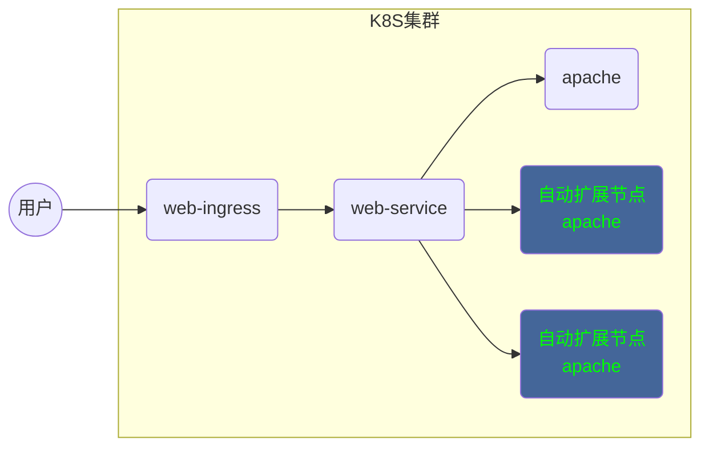

# kubernetes -- 04

## kubernetes 性能与监控

#### 部署metrics-server

###### 开启apiserver聚合服务

```yaml
[root@master ~]# vim /etc/kubernetes/manifests/kube-apiserver.yaml
# spec.containers.command 最下面手动添加如下一行
    - --enable-aggregator-routing=true
[root@master ~]# systemctl restart kubelet
[root@master ~]# kubectl -n kube-system get pod kube-apiserver-master -o yaml |grep enable-aggregator-routing
    - --enable-aggregator-routing=true
```

###### 证书的申请与签发

要在所有节点执行（master，node-0001，node-0002，node-0003）

申请的多余证书可以使用 （kubectl delete certificatesigningrequests 证书名称） 删除

```yaml
[root@node-0001 ~]# vim /var/lib/kubelet/config.yaml
# 在文件的最后一行添加
serverTLSBootstrap: true
[root@node-0001 ~]# systemctl restart kubelet
#-------------------------签发证书必须在 master 上执行 ------------------------------------
[root@master ~]# kubectl get certificatesigningrequests
NAME        AGE   REQUESTOR            CONDITION
csr-wsfz7   8s    system:node:master   Pending
[root@master ~]# kubectl certificate approve csr-wsfz7
[root@master ~]# kubectl get certificatesigningrequests
NAME        AGE   REQUESTOR            CONDITION
csr-wsfz7   86s   system:node:master   Approved,Issued
```

###### 安装mertics插件

拷贝 云盘的kubernetes/v1.17.6/mertics 目录到 master 上

```yaml
[root@master metrics]# docker load -i metrisc-server.tar.gz
[root@master metrics]# docker tag gcr.io/k8s-staging-metrics-server/metrics-server:master 192.168.1.100:5000/metrics-server:master
[root@master metrics]# docker push 192.168.1.100:5000/metrics-server:master
[root@master metrics]# vim deployment.yaml
29： image: 192.168.1.100:5000/metrics-server:master
[root@master metrics]# kubectl apply -f rbac.yaml
[root@master metrics]# kubectl apply -f pdb.yaml
[root@master metrics]# kubectl apply -f deployment.yaml
[root@master metrics]# kubectl apply -f service.yaml
[root@master metrics]# kubectl apply -f apiservice.yaml
#-------------------------------- 查询验证 ----------------------------------------------
[root@master metrics]# kubectl -n kube-system get pod
NAME                              READY   STATUS    RESTARTS   AGE
metrics-server-78dfb54777-4dcjl   1/1     Running   0          116s
[root@master metrics]# kubectl -n kube-system get apiservices
NAME                                   SERVICE                      AVAILABLE   AGE
v1beta1.metrics.k8s.io                 kube-system/metrics-server   True        2m20s
[root@master metrics]# kubectl top node
NAME        CPU(cores)   CPU%   MEMORY(bytes)   MEMORY%   
master      95m          4%     840Mi           48%       
node-0001   24m          1%     266Mi           15%       
node-0002   24m          1%     270Mi           15%       
node-0003   26m          1%     280Mi           16%   
```

#### 部署Dashboard

拷贝 云盘的kubernetes/v1.17.6/dashboard 目录到 master 上

###### 上传镜像到私有仓库

```shell
# 上传 dashboard 镜像
[root@master dashboard]# docker load -i dashboard.tar.gz 
[root@master dashboard]# docker tag kubernetesui/dashboard:v2.0.0 192.168.1.100:5000/dashboard:v2.0.0
[root@master dashboard]# docker push 192.168.1.100:5000/dashboard:v2.0.0
# 上传 metrics-scraper 镜像
[root@master dashboard]# docker load -i metrics-scraper.tar.gz 
[root@master dashboard]# docker tag kubernetesui/metrics-scraper:v1.0.4 192.168.1.100:5000/metrics-scraper:v1.0.4
[root@master dashboard]# docker push 192.168.1.100:5000/metrics-scraper:v1.0.4
```

###### 安装dashboard

```yaml
[root@master dashboard]# vim recommended.yaml
      # 43 行新添加
      nodePort: 30090
  # 46 行新添加
  type: NodePort
          # 191 行修改为
          image: 192.168.1.100:5000/dashboard:v2.0.0
          # 275 行修改为
          image: 192.168.1.100:5000/metrics-scraper:v1.0.4
[root@master dashboard]# kubectl apply -f recommended.yaml
# ---------------------------------- 查询验证 --------------------------------------
[root@master dashboard]# kubectl -n kubernetes-dashboard get pod
NAME                                         READY   STATUS    RESTARTS   AGE
dashboard-metrics-scraper-57bf85fcc9-vsz74   1/1     Running   0          52s
kubernetes-dashboard-7b7f78bcf9-5k8vq        1/1     Running   0          52s
[root@master dashboard]# kubectl -n kubernetes-dashboard get service
NAME                        TYPE        CLUSTER-IP       EXTERNAL-IP   PORT(S)
dashboard-metrics-scraper   ClusterIP   10.254.76.85     <none>        8000/TCP
kubernetes-dashboard        NodePort    10.254.211.125   <none>        443:30090/TCP
```

在华为云上为 node 节点绑定弹性公网IP [ <font color=#ff0000>https://弹性公网IP:30090/</font> ]

###### token认证登录

```shell
[root@master dashboard]# kubectl apply -f admin-token.yaml
[root@master ~]# kubectl -n kubernetes-dashboard get secrets 
NAME                               TYPE                                  DATA   AGE
admin-user-token-bxjlz             kubernetes.io/service-account-token   3      23s
[root@master ~]# kubectl -n kubernetes-dashboard describe secrets admin-user-token-bxjlz
Name:         admin-user-token-bxjlz
... ...
ca.crt:     1025 bytes
namespace:  20 bytes
token:      这里这个很长的字符串就是你要找的认证 token
```

使用获取的 token 登录，通过 web 页面访问即可

#### 部署Prometheus

###### 导入镜像

kubernetes/v1.17.6/prometheus/images/ 下所有镜像导入到私有仓库

拷贝所有镜像到 master 的 images 目录下

```shell
[root@master images]# for i in *.gz;do docker load -i ${i};done
[root@master images]# img="prom/node-exporter v1.0.0
quay.io/coreos/prometheus-config-reloader v0.35.1
quay.io/coreos/prometheus-operator v0.35.1
quay.io/coreos/kube-state-metrics v1.9.2
grafana/grafana 6.4.3
jimmidyson/configmap-reload v0.3.0
quay.io/prometheus/prometheus v2.11.0
quay.io/prometheus/alertmanager v0.18.0
quay.io/coreos/k8s-prometheus-adapter-amd64 v0.5.0
quay.io/coreos/kube-rbac-proxy v0.4.1"
[root@master images]# while read _f _v;do 
  docker tag ${_f}:${_v} 192.168.1.100:5000/${_f##*/}:${_v}
  docker push 192.168.1.100:5000/${_f##*/}:${_v}
  docker rmi ${_f}:${_v}
done <<<"${img}"
[root@master images]# curl http://192.168.1.100:5000/v2/_catalog
{"repositories":["alertmanager","configmap-reload","coredns","dashboard","etcd","flannel","grafana","k8s-prometheus-adapter-amd64","kube-apiserver","kube-controller-manager","kube-proxy","kube-rbac-proxy","kube-scheduler","kube-state-metrics","metrics-scraper","metrics-server","myos","nginx-ingress-controller","node-exporter","pause","prometheus","prometheus-config-reloader","prometheus-operator"]}
```

###### operator安装

拷贝prometheus/setup 目录到 master 下

```yaml
[root@master prometheus]# curl http://192.168.1.100:5000/v2/configmap-reload/tags/list
{"name":"configmap-reload","tags":["v0.3.0"]}
[root@master prometheus]# curl http://192.168.1.100:5000/v2/prometheus-config-reloader/tags/list
{"name":"prometheus-config-reloader","tags":["v0.35.1"]}
[root@master prometheus]# curl http://192.168.1.100:5000/v2/prometheus-operator/tags/list
{"name":"prometheus-operator","tags":["v0.35.1"]}
[root@master prometheus]# vim setup/prometheus-operator-deployment.yaml
27:        - --config-reloader-image=192.168.1.100:5000/configmap-reload:v0.3.0
28:        - --prometheus-config-reloader=192.168.1.100:5000/prometheus-config-reloader:v0.35.1
29:        image: 192.168.1.100:5000/prometheus-operator:v0.35.1
# 验证安装
[root@master prometheus]# kubectl apply -f setup/
[root@master prometheus]# kubectl -n monitoring get pod
NAME                                   READY   STATUS    RESTARTS   AGE
prometheus-operator-75b4b59b74-72qhg   1/1     Running   0          47s
```

###### prom-adapter安装

拷贝 prometheus/prom-adapter 目录到 master 下

```yaml
[root@master prometheus]# curl http://192.168.1.100:5000/v2/k8s-prometheus-adapter-amd64/tags/list
{"name":"k8s-prometheus-adapter-amd64","tags":["v0.5.0"]}
[root@master prometheus]# vim prom-adapter/prometheus-adapter-deployment.yaml
28:      image: 192.168.1.100:5000/k8s-prometheus-adapter-amd64:v0.5.0
[root@master prometheus]# kubectl apply -f prom-adapter
[root@master prometheus]# kubectl -n monitoring get pod
NAME                                   READY   STATUS    RESTARTS   AGE
prometheus-adapter-856854f9f6-knqtq    1/1     Running   0          6s
```

###### metrics-state安装

拷贝 prometheus/metrics-state 目录到 master 下

```yaml
[root@master prometheus]# curl http://192.168.1.100:5000/v2/kube-state-metrics/tags/list
{"name":"kube-state-metrics","tags":["v1.9.2"]}
[root@master prometheus]# curl http://192.168.1.100:5000/v2/kube-rbac-proxy/tags/list
{"name":"kube-rbac-proxy","tags":["v0.4.1"]}
[root@master prometheus]# vim metrics-state/kube-state-metrics-deployment.yaml
24:	        image: 192.168.1.100:5000/kube-rbac-proxy:v0.4.1
41:	        image: 192.168.1.100:5000/kube-rbac-proxy:v0.4.1
58:	        image: 192.168.1.100:5000/kube-state-metrics:v1.9.2
[root@master prometheus]# kubectl apply -f metrics-state/
[root@master prometheus]# kubectl -n monitoring get pod
NAME                                   READY   STATUS    RESTARTS   AGE
kube-state-metrics-5894f64799-krvn6    3/3     Running   0          4s
```

###### node-exporter安装

拷贝 prometheus/node-exporter 目录到 master 下

```yaml
[root@master prometheus]# curl http://192.168.1.100:5000/v2/node-exporter/tags/list
{"name":"node-exporter","tags":["v1.0.0"]}
[root@master prometheus]# curl http://192.168.1.100:5000/v2/kube-rbac-proxy/tags/list
{"name":"kube-rbac-proxy","tags":["v0.4.1"]}
[root@master prometheus]# vim node-exporter/node-exporter-daemonset.yaml
27:	        image: 192.168.1.100:5000/node-exporter:v1.0.0
57:	        image: 192.168.1.100:5000/kube-rbac-proxy:v0.4.1
[root@master prometheus]# kubectl apply -f node-exporter/
[root@master prometheus]# kubectl -n monitoring get pod
NAME                                   READY   STATUS    RESTARTS   AGE
node-exporter-7h4l9                    2/2     Running   0          7s
node-exporter-7vxmx                    2/2     Running   0          7s
node-exporter-mr6lw                    2/2     Running   0          7s
node-exporter-zg2j8                    2/2     Running   0          7s
```

###### Prometheus server安装

拷贝 prometheus/prom-server 目录到 master 下

```yaml
[root@master prometheus]# curl http://192.168.1.100:5000/v2/prometheus/tags/list
{"name":"prometheus","tags":["v2.11.0"]}
[root@master prometheus]# vim prom-server/prometheus-prometheus.yaml
14:	  baseImage: 192.168.1.100:5000/prometheus
34:	  version: v2.11.0
[root@master prometheus]# kubectl apply -f prom-server/
[root@master prometheus]# kubectl -n monitoring get pod
NAME                                   READY   STATUS    RESTARTS   AGE
prometheus-k8s-0                       3/3     Running   1          45s
prometheus-k8s-1                       3/3     Running   1          45s
```

###### alertmanager安装

拷贝 prometheus/alertmanager 目录到 master 下

```yaml
[root@master prometheus]# curl http://192.168.1.100:5000/v2/alertmanager/tags/list
{"name":"alertmanager","tags":["v0.18.0"]}
[root@master prometheus]# vim alertmanager/alertmanager-alertmanager.yaml
09:	 baseImage: 192.168.1.100:5000/alertmanager
18:	 version: v0.18.0
[root@master prometheus]# kubectl apply -f alertmanager/
[root@master prometheus]# kubectl -n monitoring get pod
NAME                                   READY   STATUS    RESTARTS   AGE
alertmanager-main-0                    2/2     Running   0          16s
alertmanager-main-1                    2/2     Running   0          16s
alertmanager-main-2                    2/2     Running   0          16s
```

###### grafana安装

拷贝 prometheus/grafana 目录到 master 下

```yaml
[root@master prometheus]# curl http://192.168.1.100:5000/v2/grafana/tags/list
{"name":"grafana","tags":["6.4.3"]}
[root@master prometheus]# vim grafana/grafana-deployment.yaml
19:     - image: 192.168.1.100:5000/grafana:6.4.3
[root@master prometheus]# kubectl apply -f grafana/
[root@master prometheus]# kubectl -n monitoring get pod
NAME                                   READY   STATUS    RESTARTS   AGE
grafana-647d948b69-d2hv9               1/1     Running   0          19s
```

###### 发布prometheus服务

1、prometheus服务

```yaml
[root@master prometheus]# cp prom-server/prometheus-service.yaml ./
[root@master prometheus]# vim prometheus-service.yaml
apiVersion: v1
kind: Service
metadata:
  labels:
    prometheus: k8s
  name: prometheus-k8s
  namespace: monitoring
spec:
  type: NodePort
  ports:
  - name: web
    port: 9090
    nodePort: 30001
    targetPort: web
  selector:
    app: prometheus
    prometheus: k8s
  sessionAffinity: ClientIP
[root@master prometheus]# kubectl apply -f prometheus-service.yaml
[root@master prometheus]# kubectl -n monitoring get service
NAME                    TYPE        CLUSTER-IP       EXTERNAL-IP   PORT(S)
prometheus-k8s          NodePort    10.254.111.220   <none>        9090:30001/TCP
```

2、grafana服务

```yaml
[root@master prometheus]# cp grafana/grafana-service.yaml ./
[root@master prometheus]# vim grafana-service.yaml
apiVersion: v1
kind: Service
metadata:
  labels:
    app: grafana
  name: grafana
  namespace: monitoring
spec:
  type: NodePort
  ports:
  - name: http
    port: 3000
    nodePort: 30002
    targetPort: http
  selector:
    app: grafana
[root@master prometheus]# kubectl apply -f grafana-service.yaml
[root@master prometheus]# kubectl -n monitoring get service
NAME                    TYPE        CLUSTER-IP       EXTERNAL-IP   PORT(S)
grafana                 NodePort    10.254.79.49     <none>        3000:30002/TCP
```

服务发布以后可以通过华为云弹性公网IP直接访问即可

grafana 第一次默认登录的用户名/密码（admin/admin）

#### HPA集群

###### 集群图例




###### 实验步骤

```yaml
[root@master ~]# vim hpa-example.yaml 
---
apiVersion: apps/v1
kind: Deployment
metadata:
  name: myweb
spec:
  selector:
    matchLabels:
      app: apache
  replicas: 1
  template:
    metadata:
      labels:
        app: apache
    spec:
      containers:
      - name: apache
        image: 192.168.1.100:5000/myos:httpd
        ports:
        - containerPort: 80
        resources:
          requests:
            cpu: 200m
      restartPolicy: Always

---
apiVersion: v1
kind: Service
metadata:
  name: web-service
spec:
  ports:
  - protocol: TCP
    port: 80
    targetPort: 80
  selector:
    app: apache
  type: ClusterIP

---
apiVersion: extensions/v1beta1
kind: Ingress
metadata:
  name: my-app
  annotations:
    kubernetes.io/ingress.class: "nginx"
spec:
  backend:
    serviceName: web-service
    servicePort: 80

---
apiVersion: autoscaling/v1
kind: HorizontalPodAutoscaler
metadata:
  name: myweb
spec:
  minReplicas: 1
  maxReplicas: 3
  scaleTargetRef:
    apiVersion: apps/v1
    kind: Deployment
    name: myweb
  targetCPUUtilizationPercentage: 50
[root@master ~]# kubectl apply -f hpa-example.yaml
[root@master ~]# kubectl get hpa
NAME    REFERENCE          TARGETS   MINPODS   MAXPODS   REPLICAS   AGE
myweb   Deployment/myweb   0%/50%    1         3         1          15m
```

当容器的cpu占用超过 50% 的时候，自动扩展一个POD，依次扩展，一直到最大值

如果cpu访问不足 50% 的时候，每 300s 缩减一个 POD 节点，直到最小值时停止

访问测试可以使用镜像内提供的 info.php增加系统负载，从而查看状态信息

访问地址  http://ip.xx.xx.xx/info.php?id=1000000

id 为计算结果集的数量，id 越大，占用内存和CPU越高，设置特别大容易死机