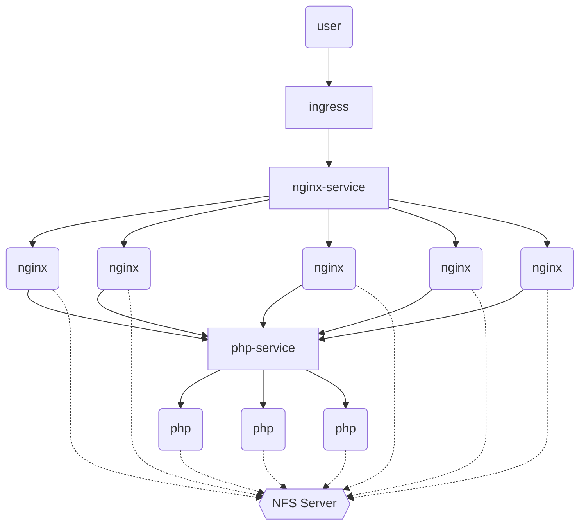

# 实验目标

## nginx&php读写分离集群(K8S)

#### 集群架构解析



#### 部署步骤

###### 1、集群主机配置

| 主机名称  | ip地址        | 备注        |
| --------- | ------------- | ----------- |
| master    | 192.168.1.21  | K8S管理节点 |
| node-0001 | 192.168.1.31  | K8S计算节点 |
| node-0002 | 192.168.1.32  | K8S计算节点 |
| node-0003 | 192.168.1.33  | K8S计算节点 |
| node-0004 | 192.168.1.34  | K8S计算节点 |
| node-0005 | 192.168.1.35  | K8S计算节点 |
| registry  | 192.168.1.100 | K8S镜像仓库 |

###### 2、配置镜像仓库

跳板机配置yum仓库

```shell
[root@ecs-proxy ~]# cp -a kubernetes/docker  /var/ftp/localrepo/
[root@ecs-proxy ~]# cp -a kubernetes/v1.17.6/k8s-install  /var/ftp/localrepo/
[root@ecs-proxy ~]# cd /var/ftp/localrepo/
[root@ecs-proxy localrepo]# createrepo --update .
```

私有仓库安装

```shell
[root@registry ~]# yum install -y docker-ce docker-distribution
[root@registry ~]# mkdir -p /etc/docker
[root@registry ~]# vim /etc/docker/daemon.json
{
    "exec-opts": ["native.cgroupdriver=systemd"],
    "registry-mirrors": ["https://hub-mirror.c.163.com"],
    "insecure-registries":["192.168.1.100:5000", "registry:5000"]
}
[root@registry ~]# systemctl enable --now docker docker-distribution
```

导入备份的 myos 镜像（docker  load， docker  tag， docker  push）

myos镜像备份云盘路径 kubernetes/v1.17.6/registry/myos 目录为备份

下载 myos.tar.gz 和 init-img.sh 到同一个目录下，执行 init-img.sh 完成镜像导入

###### 3、配置管理节点

基础环境安装

```shell
[root@master ~]# yum makecache
[root@master ~]# yum install -y kubeadm kubelet kubectl docker-ce
[root@master ~]# mkdir -p /etc/docker
[root@master ~]# vim /etc/docker/daemon.json 
{
    "exec-opts": ["native.cgroupdriver=systemd"],
    "registry-mirrors": ["https://hub-mirror.c.163.com"],
    "insecure-registries":["192.168.1.100:5000", "registry:5000"]
}
[root@master ~]# systemctl enable --now docker kubelet
[root@master ~]# docker info |grep Cgroup
Cgroup Driver: systemd
[root@master ~]# vim /etc/sysctl.d/k8s.conf
net.bridge.bridge-nf-call-ip6tables = 1
net.bridge.bridge-nf-call-iptables = 1
net.ipv4.ip_forward = 1
[root@master ~]# modprobe br_netfilter
[root@master ~]# sysctl --system
```

导入镜像仓库

拷贝 云盘 kubernetes/v1.17.6/base-images 目录到 master 主机

```shell
[root@master ~]# cd base-images/
[root@master base-image]# for i in *.tar.gz;do docker load -i ${i};done
[root@master base-image]# docker images |awk '$2!="TAG"{print $1,$2}'|while read _f _v;do
    docker tag ${_f}:${_v} 192.168.1.100:5000/${_f##*/}:${_v}; 
    docker push 192.168.1.100:5000/${_f##*/}:${_v}; 
    docker rmi ${_f}:${_v}; 
done
[root@master base-image]# curl http://192.168.1.100:5000/v2/_catalog
```

master安装

```shell
[root@master ~]# kubectl completion bash >/etc/bash_completion.d/kubectl
[root@master ~]# kubeadm completion bash >/etc/bash_completion.d/kubeadm
[root@master ~]# exit
#---------------------------------------重新登录------------------------------------------
[root@master ~]# yum install -y ipvsadm ipset
[root@master ~]# vim /etc/hosts
192.168.1.21	master
192.168.1.31	node-0001
192.168.1.32	node-0002
192.168.1.33	node-0003
192.168.1.34	node-0004
192.168.1.35	node-0005
192.168.1.100	registry
[root@master ~]# kubeadm init --dry-run
[root@master ~]# mkdir init
# 拷贝云盘 kubernetes/v1.17.6/config/kubeadm-init.yaml 到 init 目录下
[root@master init]# kubeadm init --config=kubeadm-init.yaml |tee master-init.log
# 根据提示执行命令
[root@master init]# mkdir -p $HOME/.kube
[root@master init]# sudo cp -i /etc/kubernetes/admin.conf $HOME/.kube/config
[root@master init]# sudo chown $(id -u):$(id -g) $HOME/.kube/config
[root@master ~]# kubectl version
[root@master ~]# kubectl get componentstatuses
NAME                        STATUS      	MESSAGE             	ERROR
controller-manager       	Healthy         ok
scheduler                   Healthy   		ok
etcd-0                 		Healthy   		{"health":"true"}
```

###### 4、配置计算节点

在 master 上获取 token

```shell
[root@master ~]# kubeadm token delete abcdef.0123456789abcdef
bootstrap token "abcdef" deleted
[root@master ~]# kubeadm token create --ttl=0 --print-join-command 
W0727 10:14:55.173265    4867 validation.go:28] Cannot validate kube-proxy config - no validator is available
W0727 10:14:55.173318    4867 validation.go:28] Cannot validate kubelet config - no validator is available
kubeadm join 192.168.1.21:6443 --token os636d.olkyvjokf2619n67     --discovery-token-ca-cert-hash sha256:bf008b1bf8f10805c755e155eb51429b517c257c2822a7366fda291c103f12ef 
```

拷贝云盘上 kubernetes/v1.17.6/node-install 到跳板机

```shell
[root@ecs-proxy ~]# cd node-install/
[root@ecs-proxy node-install]# cat hostlist.yaml 
all:
  children:
    nodes:
      hosts:
        192.168.1.31: {}
        192.168.1.32: {}
        192.168.1.33: {}
        192.168.1.34: {}
        192.168.1.35: {}
    ungrouped: {}
[root@ecs-proxy node-install]# vim files/hosts 
::1		localhost	localhost.localdomain	localhost6	localhost6.localdomain6
127.0.0.1	localhost	localhost.localdomain	localhost4	localhost4.localdomain4
192.168.1.21	master
192.168.1.31	node-0001
192.168.1.32	node-0002
192.168.1.33	node-0003
192.168.1.34	node-0004
192.168.1.35	node-0005
192.168.1.100	registry
[root@ecs-proxy node-install]# vim node_install.yaml
... ...
  vars:
    master: '192.168.1.21:6443'
    token: 'os636d.olkyvjokf2619n67'
    token_hash: 'sha256:bf008b1bf8f10805c755e155eb51429b517c257c2822a7366fda291c103f12ef'
... ...
[root@ecs-proxy node-install]# ansible-playbook node_install.yaml
```

安装完成以后，进入 master 查看 node 状态

```shell
[root@master ~]# kubectl get nodes
NAME        STATUS     ROLES    AGE     VERSION
master      NotReady   master   12m     v1.17.6
node-0001   NotReady   <none>   2m11s   v1.17.6
node-0002   NotReady   <none>   2m11s   v1.17.6
node-0003   NotReady   <none>   2m18s   v1.17.6
node-0004   NotReady   <none>   10s     v1.17.6
node-0005   NotReady   <none>   11s     v1.17.6
```

###### 5、配置flannel网络

拷贝云盘 kubernetes/v1.17.6/flannel 目录到 master 上

```shell
[root@master flannel]# docker load -i flannel.tar.gz
[root@master flannel]# docker tag quay.io/coreos/flannel:v0.12.0-amd64 192.168.1.100:5000/flannel:v0.12.0-amd64
[root@master flannel]# docker push 192.168.1.100:5000/flannel:v0.12.0-amd64
[root@master flannel]# vim kube-flannel.yml
128: "Network": "10.244.0.0/16",
172: image: 192.168.1.100:5000/flannel:v0.12.0-amd64
186: image: 192.168.1.100:5000/flannel:v0.12.0-amd64
227-结尾: 删除
[root@master flannel]# kubectl apply -f kube-flannel.yml
[root@master flannel]# kubectl get nodes
NAME        STATUS   ROLES    AGE     VERSION
master      Ready    master   16m     v1.17.6
node-0001   Ready    <none>   5m56s   v1.17.6
node-0002   Ready    <none>   5m56s   v1.17.6
node-0003   Ready    <none>   6m3s    v1.17.6
node-0004   Ready    <none>   3m55s   v1.17.6
node-0005   Ready    <none>   3m56s   v1.17.6
```

#### 集群应用部署

###### 部署NFS服务

我们使用 registry 云主机提供 nfs 文件共享服务

```shell
[root@registry ~]# yum install -y nfs-utils
[root@registry ~]# mkdir -m 0777 /var/webroot
# 拷贝 info.html 和 info.php 到这个目录下
[root@registry ~]# vim /etc/exports
/var/webroot	*(rw)
[root@registry ~]# systemctl enable --now nfs
[root@registry ~]# showmount -e 192.168.1.100
Export list for 192.168.1.100:
/var/webroot *
```

所有节点安装 nfs-utils 软件包

```shell
[root@master ~]# yum install -y nfs-utils
#----------------------------------------------------------------------------------------
[root@node-0001 ~]# yum install -y nfs-utils
#----------------------------------------------------------------------------------------
[root@node-0002 ~]# yum install -y nfs-utils
#----------------------------------------------------------------------------------------
[root@node-0003 ~]# yum install -y nfs-utils
#----------------------------------------------------------------------------------------
[root@node-0004 ~]# yum install -y nfs-utils
#----------------------------------------------------------------------------------------
[root@node-0005 ~]# yum install -y nfs-utils
```

###### ingress控制安装

拷贝云盘 kubernetes/v1.17.6/ingress 目录到 master 上

```shell
[root@master ingress]# docker load -i ingress-nginx.tar.gz
[root@master ingress]# docker tag quay.io/kubernetes-ingress-controller/nginx-ingress-controller:0.30.0 192.168.1.100:5000/nginx-ingress-controller:0.30.0
[root@master ingress]# docker push 192.168.1.100:5000/nginx-ingress-controller:0.30.0
[root@master ingress]# curl http://192.168.1.100:5000/v2/nginx-ingress-controller/tags/list
{"name":"nginx-ingress-controller","tags":["0.30.0"]}
[root@master ingress]# vim mandatory.yaml
221: image: 192.168.1.100:5000/nginx-ingress-controller:0.30.0
[root@master ingress]# kubectl apply -f mandatory.yaml
[root@master ingress]# kubectl -n ingress-nginx get pod
NAME                                      READY   STATUS    RESTARTS   AGE
nginx-ingress-controller-fc6766d7-6ld66   1/1     Running   0          36s
```

###### 部署应用

```shell
[root@master ~]# mkdir webapp
[root@master ~]# cd webapp/
```

01-pv.yaml 资源文件

```yaml
[root@master webapp]# vim 01-pv.yaml 
---
apiVersion: v1
kind: PersistentVolume
metadata:
  name:  pv-nfs
  labels:
    app: web-nfs
spec:
  volumeMode: Filesystem
  capacity:
    storage: 30Gi
  accessModes:
  - ReadWriteMany
  persistentVolumeReclaimPolicy: Retain
  nfs:
    path: /var/webroot
    server: 192.168.1.100
```

02-pvc.yaml 资源文件

```yaml
[root@master webapp]# vim 02-pvc.yaml 
---
apiVersion: v1
kind: PersistentVolumeClaim
metadata:
  name: pvc-nfs
spec:
  volumeMode: Filesystem
  accessModes:
    - ReadWriteMany
  resources:
    requests:
      storage: 20Gi
  selector:
    matchLabels:
      app: web-nfs
```

03-php-deployment.yaml

```yaml
[root@master webapp]# vim 03-php-deployment.yaml 
---
apiVersion: apps/v1
kind: Deployment
metadata:
  name: php-deploy
spec:
  selector:
    matchLabels:
      app: myapp-php
  replicas: 3
  template:
    metadata:
      labels:
        app: myapp-php
    spec:
      volumes:
      - name: web-site
        persistentVolumeClaim:
          claimName: pvc-nfs
      containers:
      - name: php-fpm
        image: 192.168.1.100:5000/myos:php-fpm
        ports:
        - protocol: TCP
          containerPort: 9000
        volumeMounts:
        - name: web-site
          mountPath: /usr/local/nginx/html
      restartPolicy: Always
```

04-php-service.yaml

```yaml
[root@master webapp]# cat 04-php-service.yaml 
---
apiVersion: v1
kind: Service
metadata:
  name: php-service
spec:
  ports:
  - protocol: TCP
    port: 9000
    targetPort: 9000
  selector:
    app: myapp-php
  type: ClusterIP
```

05  创建configmap

首先从镜像中获取 nginx.conf 配置文件

```shell
[root@master webapp]# docker run -itd --name=webtest 192.168.1.100:5000/myos:nginx 
1717dbf14c5cc0b674538d54d9b5551453140dbb751700459aafd0b8748b2349
[root@master webapp]# docker cp webtest:/usr/local/nginx/conf/nginx.conf ./
[root@master webapp]# docker rm -f webtest 
[root@master webapp]# vim nginx.conf
... ...
        location ~ \.php$ {
            root           html;
            fastcgi_pass   php-service:9000;
            fastcgi_index  index.php;
            include        fastcgi.conf;
        }
... ...
[root@master webapp]# kubectl create configmap nginx-conf --from-file=nginx.conf 
[root@master webapp]# kubectl get configmaps 
NAME         DATA   AGE
nginx-conf   1      10s
```

05-nginx-deployment.yaml

```yaml
[root@master webapp]# vim 05-nginx-deployment.yaml
---
apiVersion: apps/v1
kind: Deployment
metadata:
  name: nginx-deploy
spec:
  selector:
    matchLabels:
      app: myapp-nginx
  replicas: 5
  template:
    metadata:
      labels:
        app: myapp-nginx
    spec:
      volumes:
      - name: nginx-php
        configMap:
          name: nginx-conf
      - name: web-site
        persistentVolumeClaim:
          claimName: pvc-nfs
      containers:
      - name: nginx
        image: 192.168.1.100:5000/myos:nginx
        ports:
        - protocol: TCP
          containerPort: 80
        volumeMounts:
        - name: nginx-php
          subPath: nginx.conf
          mountPath: /usr/local/nginx/conf/nginx.conf
        - name: web-site
          mountPath: /usr/local/nginx/html
      restartPolicy: Always
```

06-nginx-service.yaml

```yaml
[root@master webapp]# vim 06-nginx-service.yaml 
---
apiVersion: v1
kind: Service
metadata:
  name: nginx-service
spec:
  ports:
  - protocol: TCP
    port: 80
    targetPort: 80
  selector:
    app: myapp-nginx
  type: ClusterIP
```

07-ingress-webapp.yaml

```yaml
[root@master webapp]# vim 07-ingress-webapp.yaml 
---
apiVersion: extensions/v1beta1
kind: Ingress
metadata:
  name: myapp
  annotations:
    kubernetes.io/ingress.class: "nginx"
spec:
  backend:
    serviceName: nginx-service
    servicePort: 80
```

08 加载集群配置，依次执行 01 ... 07 的资源文件

```shell
[root@master webapp]# kubectl apply -f 01-pv.yaml
[root@master webapp]# kubectl apply -f 02-pvc.yaml
[root@master webapp]# kubectl apply -f 03-php-deployment.yaml
[root@master webapp]# kubectl apply -f 04-php-service.yaml
[root@master webapp]# kubectl apply -f 05-nginx-deployment.yaml
[root@master webapp]# kubectl apply -f 06-nginx-service.yaml
[root@master webapp]# kubectl apply -f 07-ingress-webapp.yaml
```

09 配置华为云，绑定弹性公网IP访问

```shell
[root@master webapp]# kubectl get ingress
NAME    HOSTS   ADDRESS        PORTS   AGE
myapp   *       192.168.1.35   80      46s
[root@ecs-proxy ~]# curl http://192.168.1.35/info.html
<html>
  <marquee  behavior="alternate">
      <font size="12px" color=#00ff00>Hello World</font>
  </marquee>
</html>
[root@ecs-proxy ~]# curl http://192.168.1.35/info.php
<pre>
Array
(
    [REMOTE_ADDR] => 10.244.4.0
    [REQUEST_METHOD] => GET
    [HTTP_USER_AGENT] => curl/7.29.0
    [REQUEST_URI] => /info.php
)
php_host: 	php-deploy-77fbb57846-zj2fl
1229
```

