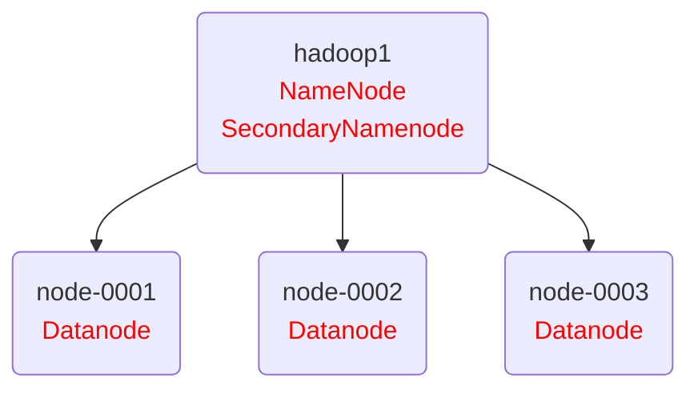
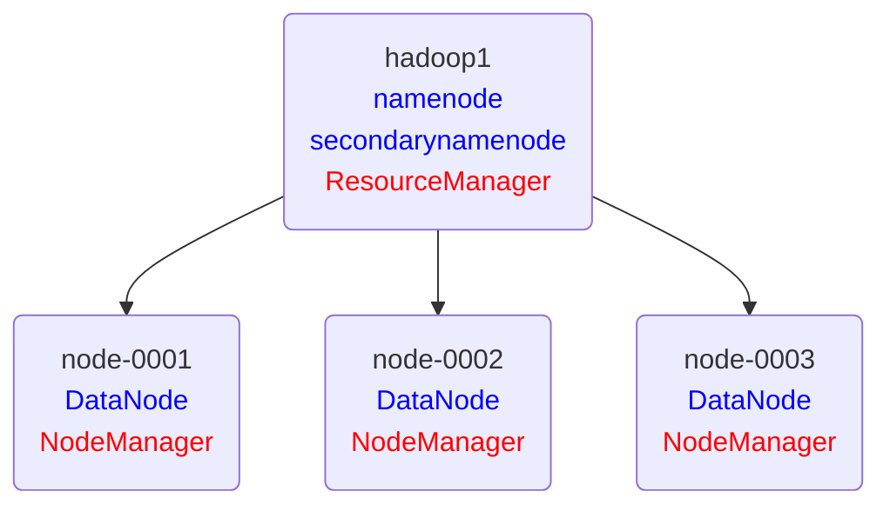

# Hadoop -- 01

## Hadoop分布式集群

#### 单机安装部署

###### 购买云主机 

| 主机    | IP地址       | 配置          |
| ------- | ------------ | ------------- |
| hadoop1 | 192.168.1.50 | 最低配置2核2G |

###### hadoop安装

拷贝云盘 public/hadoop/hadoop-2.7.7.tar.gz 到 hadoop1 上

```shell
[root@hadoop1 ~]# yum install -y java-1.8.0-openjdk java-1.8.0-openjdk-devel
[root@hadoop1 ~]# tar -zxf hadoop-2.7.7.tar.gz
[root@hadoop1 ~]# mv hadoop-2.7.7 /usr/local/hadoop
[root@hadoop1 ~]# chown -R 0.0 /usr/local/hadoop
```

###### 配置JAVA运行环境

```shell
[root@hadoop1 ~]# vim /etc/hosts
192.168.1.50	hadoop1
[root@hadoop1 ~]# vim /usr/local/hadoop/etc/hadoop/hadoop-env.sh
25:  export JAVA_HOME="java-1.8.0-openjdk安装路径"
33:  export HADOOP_CONF_DIR="/usr/local/hadoop/etc/hadoop"
[root@hadoop1 ~]# /usr/local/hadoop/bin/hadoop version
```

###### 热点词汇分析

```shell
[root@hadoop1 ~]# cd /usr/local/hadoop
[root@hadoop1 hadoop]# mkdir input
[root@hadoop1 hadoop]# cp *.txt input/
[root@hadoop1 hadoop]# ./bin/hadoop jar share/hadoop/mapreduce/hadoop-mapreduce-examples-2.7.7.jar wordcount ./input ./output
[root@hadoop1 hadoop]# cat ./output/*
```

#### 集群安装部署

###### 购买云主机 

| 主机      | IP地址       | 配置          |
| --------- | ------------ | ------------- |
| hadoop1   | 192.168.1.50 | 最低配置2核2G |
| node-0001 | 192.168.1.51 | 最低配置2核2G |
| node-0002 | 192.168.1.52 | 最低配置2核2G |
| node-0003 | 192.168.1.53 | 最低配置2核2G |

###### HDFS架构图



###### HDFS部署

以下操作所有机器都要执行

```shell
[root@hadoop1 ~]# yum install -y java-1.8.0-openjdk java-1.8.0-openjdk-devel
[root@hadoop1 ~]# vim /etc/hosts
192.168.1.50	hadoop1
192.168.1.51	node-0001
192.168.1.52	node-0002
192.168.1.53	node-0003
```

以下操作仅在 hadoop1 上执行

```shell
[root@hadoop1 ~]# vim /etc/ssh/ssh_config
# 60行新添加
	StrictHostKeyChecking no
[root@hadoop1 ~]# ssh-keygen -t rsa -b 2048 -N '' -f /root/.ssh/id_rsa
[root@hadoop1 ~]# for i in hadoop1 node-{0001..0003};do
                      ssh-copy-id -i /root/.ssh/id_rsa.pub ${i}
                  done
```

配置文件语法格式 -- [官方手册](http://hadoop.apache.org/docs/r2.7.7/)

```xml
    <property>
        <name></name>
        <value></value>
    </property>
```

1、配置 hadoop-env.sh 参考 配置JAVA运行环境 案例

2、配置slaves

```shell
[root@hadoop1 ~]# vim /usr/local/hadoop/etc/hadoop/slaves
node-0001
node-0002
node-0003
```

3、配置core-site.xml

```xml
[root@hadoop1 ~]# vim /usr/local/hadoop/etc/hadoop/core-site.xml
<configuration>
    <property>
        <name>fs.defaultFS</name>
        <value>hdfs://hadoop1:9000</value>
    </property>
    <property>
        <name>hadoop.tmp.dir</name>
        <value>/var/hadoop</value>
    </property>
</configuration>
```

4、配置hdfs-site.xml

```xml
[root@hadoop1 ~]# vim /usr/local/hadoop/etc/hadoop/hdfs-site.xml
<configuration>
    <property>
        <name>dfs.namenode.http-address</name>
        <value>hadoop1:50070</value>
    </property>
    <property>
        <name>dfs.namenode.secondary.http-address</name>
        <value>hadoop1:50090</value>
    </property>
    <property>
        <name>dfs.replication</name>
        <value>2</value>
    </property>
</configuration>
```

5、启动集群 [以下操作仅在 hadoop1 上执行]

```shell
[root@hadoop1 ~]# for i in node-{0001..0003};do
                      rsync -aXSH --delete /usr/local/hadoop ${i}:/usr/local/
                  done
[root@hadoop1 ~]# mkdir /var/hadoop
[root@hadoop1 ~]# /usr/local/hadoop/bin/hdfs namenode -format
[root@hadoop1 ~]# /usr/local/hadoop/sbin/start-dfs.sh
```

6、验证集群配置

```shell
[root@hadoop1 ~]# for i in hadoop1 node-{0001..0003};do  
                      echo ${i}; 
                      ssh ${i} jps; 
                      echo -e "\n"; 
                  done
[root@hadoop1 ~]# /usr/local/hadoop/bin/hdfs dfsadmin -report
... ...
-------------------------------------------------
Live datanodes (3):
```

###### mapreduce部署

```xml
[root@hadoop1 ~]# cd /usr/local/hadoop/etc/hadoop/
[root@hadoop1 hadoop]# cp mapred-site.xml.template mapred-site.xml
[root@hadoop1 hadoop]# vim mapred-site.xml
<configuration>
    <property>
        <name>mapreduce.framework.name</name>
        <value>yarn</value>
    </property>
</configuration>
```

###### YARN架构图



###### Yarn部署

```xml
[root@hadoop1 ~]# vim /usr/local/hadoop/etc/hadoop/yarn-site.xml
<configuration>
    <property>
        <name>yarn.resourcemanager.hostname</name>
        <value>hadoop1</value>
    </property>
<!-- Site specific YARN configuration properties -->
    <property>
        <name>yarn.nodemanager.aux-services</name>
        <value>mapreduce_shuffle</value>
    </property>
</configuration>
```

启动集群 [以下操作仅在 hadoop1 上执行]

```shell
[root@hadoop1 ~]# for i in node-{0001..0003};do
                    rsync -avXSH --delete /usr/local/hadoop/etc  ${i}:/usr/local/hadoop/
                  done
[root@hadoop1 ~]# /usr/local/hadoop/sbin/start-yarn.sh
```

验证集群

```shell
[root@hadoop1 ~]# for i in hadoop1 node-{0001..0003};do  
                      echo ${i}; 
                      ssh ${i} jps; 
                      echo -e "\n"; 
                  done
[root@hadoop1 ~]# /usr/local/hadoop/bin/yarn node -list
Total Nodes:3
 Node-Id             Node-State Node-Http-Address       Number-of-Running-Containers
 node-0003:33212     RUNNING    node-0003:8042                                  0
 node-0001:40201     RUNNING    node-0001:8042                                  0
 node-0002:38830     RUNNING    node-0002:8042                                  0
```

web页面访问

namenode:  http://hadoop1:50070

secondarynamenode:  http://hadoop1:50090

resourcemanager:  http://hadoop1:8088

datanode:  http://node-0001:50075

nodemanager:  http://node-0001:8042