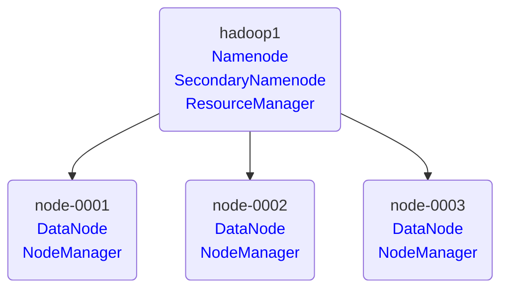
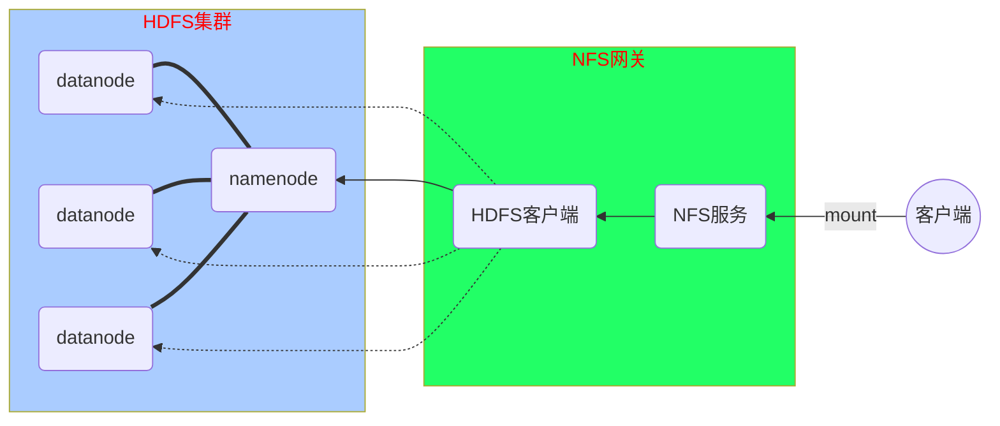

# Hadoop -- 02

## Hadoop集群管理

#### 集群架构图例




#### 重新初始化集群

​    警告：<font color=ff0000>该方法会丢失所有数据</font>

​    1、停止集群  /usr/local/hadoop/sbin/stop-all.sh
​    2、删除所有节点的  /var/hadoop/*
​    3、在 hadoop1 上重新格式化 /usr/local/hadoop/bin/hdfs namenode -format
​    4、启动集群  /usr/local/hadoop/sbin/start-all.sh

```shell
[root@hadoop1 ~]# /usr/local/hadoop/sbin/stop-all.sh
[root@hadoop1 ~]# for i in hadoop1 node-{0001..0003};do
                      ssh ${i} 'rm -rf /var/hadoop/*'
                  done
[root@hadoop1 ~]# /usr/local/hadoop/bin/hdfs namenode -format
[root@hadoop1 ~]# /usr/local/hadoop/sbin/start-all.sh
```

#### 增加新的节点

###### 购买云主机 

| 主机    | IP地址       | 配置          |
| ------- | ------------ | ------------- |
| newnode | 192.168.1.54 | 最低配置2核2G |

###### 新节点安装

在 hadoop1 上执行

```shell
[root@hadoop1 ~]# ssh-copy-id -i /root/.ssh/id_rsa.pub 192.168.1.54
[root@hadoop1 ~]# vim /etc/hosts
192.168.1.50    hadoop1
192.168.1.51    node-0001
192.168.1.52    node-0002
192.168.1.53    node-0003
192.168.1.54    newnode
[root@hadoop1 ~]# for i in node-{0001..0003} newnode;do
                      rsync -av /etc/hosts ${i}:/etc/
                  done
[root@hadoop1 ~]# rsync -aXSH /usr/local/hadoop newnode:/usr/local/
```

在 newnode 节点执行

```shell
[root@newnode ~]# yum install -y java-1.8.0-openjdk-devel
[root@newnode ~]# /usr/local/hadoop/sbin/hadoop-daemon.sh start datanode
[root@newnode ~]# /usr/local/hadoop/bin/hdfs dfsadmin -setBalancerBandwidth  500000000
[root@newnode ~]# /usr/local/hadoop/sbin/start-balancer.sh
[root@newnode ~]# /usr/local/hadoop/sbin/yarn-daemon.sh start nodemanager
[root@newnode ~]# jps
1186 DataNode
1431 NodeManager
1535 Jps
```

验证集群(hadoop1上执行)

```shell
[root@hadoop1 ~]# /usr/local/hadoop/bin/hdfs dfsadmin -report
... ...
-------------------------------------------------
Live datanodes (4):
[root@hadoop1 ~]# /usr/local/hadoop/bin/yarn node -list
... ...
Total Nodes:4
```

###### 删除节点

配置数据迁移 hdfs-site.xml（hadoop1上做，不需要同步）

```xml    <property>
[root@hadoop1 ~]# vim /usr/local/hadoop/etc/hadoop/hdfs-site.xml
    <property>
        <name>dfs.hosts.exclude</name>
        <value>/usr/local/hadoop/etc/hadoop/exclude</value>
    </property>
```
配置排除主机列表，并迁移数据(hadoop1上执行)

```shell
# 在删除配置文件中添加 newnode
[root@hadoop1 ~]# echo newnode >/usr/local/hadoop/etc/hadoop/exclude
# 迁移数据
[root@hadoop1 ~]# /usr/local/hadoop/bin/hdfs dfsadmin -refreshNodes
# 查看状态，仅当节点状态为 Decommissioned 时候才可以下线
[root@hadoop1 ~]# /usr/local/hadoop/bin/hdfs dfsadmin -report
```
下线节点（newnode执行）
```shell
[root@newnode ~]# /usr/local/hadoop/sbin/hadoop-daemon.sh stop datanode
[root@newnode ~]# /usr/local/hadoop/sbin/yarn-daemon.sh stop nodemanager
```

#### NFS网关

###### NFS网关架构图



###### 购买云主机 

| 主机  | IP地址       | 配置          |
| ----- | ------------ | ------------- |
| nfsgw | 192.168.1.55 | 最低配置1核1G |

###### HDFS用户授权

hadoop1与nfsgw都要添加用户

```shell
[root@hadoop1 ~]# groupadd -g 800 nfsuser
[root@hadoop1 ~]# useradd  -g 800 -u 800 -r -d /var/hadoop nfsuser
#----------------------------------------------------------------------------------------
[root@nfsgw ~]# groupadd -g 800 nfsuser
[root@nfsgw ~]# useradd  -g 800 -u 800 -r -d /var/hadoop nfsuser
```

###### HDFS集群授权

```shell
[root@hadoop1 ~]# vim /usr/local/hadoop/etc/hadoop/core-site.xml
<configuration>
    <property>
        <name>fs.defaultFS</name>
        <value>hdfs://hadoop1:9000</value>
    </property>
    <property>
        <name>hadoop.tmp.dir</name>
        <value>/var/hadoop</value>
    </property>
    <property>
        <name>hadoop.proxyuser.nfsuser.groups</name>
        <value>*</value>
    </property>
    <property>
        <name>hadoop.proxyuser.nfsuser.hosts</name>
        <value>*</value>
    </property>
</configuration>
[root@hadoop1 ~]# /usr/local/hadoop/sbin/stop-all.sh
[root@hadoop1 ~]# for i in node-{0001..0003};do
                      rsync -avXSH /usr/local/hadoop/etc ${i}:/usr/local/hadoop/
                  done
[root@hadoop1 ~]# /usr/local/hadoop/sbin/start-dfs.sh
[root@hadoop1 ~]# jps
5925 NameNode
6122 SecondaryNameNode
6237 Jps
[root@hadoop1 ~]# /usr/local/hadoop/bin/hdfs dfsadmin -report
... ...
-------------------------------------------------
Live datanodes (3):
```

###### NFS网关服务

```shell
[root@nfsgw ~]# yum remove -y rpcbind nfs-utils
[root@nfsgw ~]# vim /etc/hosts
192.168.1.50    hadoop1
192.168.1.51    node-0001
192.168.1.52    node-0002
192.168.1.53    node-0003
192.168.1.55    nfsgw
[root@nfsgw ~]# yum install -y java-1.8.0-openjdk-devel
[root@nfsgw ~]# rsync -aXSH --delete hadoop1:/usr/local/hadoop /usr/local/
[root@nfsgw ~]# vim /usr/local/hadoop/etc/hadoop/hdfs-site.xml
<configuration>
    <property>
        <name>dfs.namenode.http-address</name>
        <value>hadoop1:50070</value>
    </property>
    <property>
        <name>dfs.namenode.secondary.http-address</name>
        <value>hadoop1:50090</value>
    </property>
    <property>
        <name>dfs.replication</name>
        <value>2</value>
    </property>
    <property>
        <name>dfs.hosts.exclude</name>
        <value>/usr/local/hadoop/etc/hadoop/exclude</value>
    </property>
    <property>
        <name>nfs.exports.allowed.hosts</name>
        <value>* rw</value>
    </property>
    <property>
        <name>nfs.dump.dir</name>
        <value>/var/nfstmp</value>
    </property>
</configuration>
[root@nfsgw ~]# mkdir /var/nfstmp
[root@nfsgw ~]# chown nfsuser.nfsuser /var/nfstmp
[root@nfsgw ~]# rm -rf /usr/local/hadoop/logs/*
[root@nfsgw ~]# setfacl -m user:nfsuser:rwx /usr/local/hadoop/logs
[root@nfsgw ~]# getfacl /usr/local/hadoop/logs
[root@nfsgw ~]# cd /usr/local/hadoop/
[root@nfsgw hadoop]# ./sbin/hadoop-daemon.sh --script ./bin/hdfs start portmap
[root@nfsgw hadoop]# jps
1376 Portmap
1416 Jps
[root@nfsgw hadoop]# rm -rf /tmp/.hdfs-nfs
[root@nfsgw hadoop]# sudo -u nfsuser ./sbin/hadoop-daemon.sh --script ./bin/hdfs start nfs3
[root@nfsgw hadoop]# sudo -u nfsuser jps
1452 Nfs3
1502 Jps
```

###### mount验证

```shell
[root@newnode ~]# yum install -y nfs-utils
[root@newnode ~]# showmount -e 192.168.1.55
Export list for 192.168.1.55:
/ *
[root@newnode ~]# mount -t nfs -o vers=3,proto=tcp,nolock,noacl,noatime,sync 192.168.1.55:/ /mnt/
[root@newnode ~]# df -h
Filesystem      Size  Used Avail Use% Mounted on
192.168.1.55:/  118G   15G  104G  13% /mnt
```

