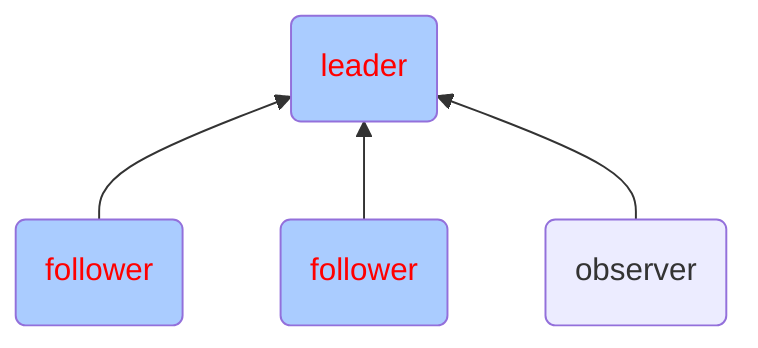
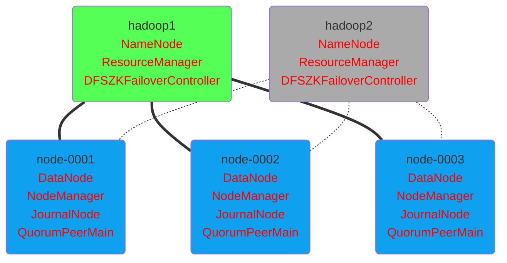

# Hadoop -- 03

## Hadoop集群及组件

#### zookeeper集群图例




#### zookeeper集群

###### 集群安装

1、重启云主机 hadoop1,node-0001,node-0002,node-0003

2、在 hadoop1 上安装配置 zookeeper，并同步给其他主机

拷贝云盘 public/hadoop/zookeeper-3.4.13.tar.gz 到hadoop1

```shell
[root@hadoop1 ~]# yum install -y java-1.8.0-openjdk-devel
[root@hadoop1 ~]# tar zxf zookeeper-3.4.13.tar.gz
[root@hadoop1 ~]# mv zookeeper-3.4.13 /usr/local/zookeeper
[root@hadoop1 ~]# cd /usr/local/zookeeper/conf/
[root@hadoop1 conf]# cp zoo_sample.cfg zoo.cfg
[root@hadoop1 conf]# vim zoo.cfg
# 配置文件最后添加
server.1=node-0001:2888:3888
server.2=node-0002:2888:3888
server.3=node-0003:2888:3888
server.4=hadoop1:2888:3888:observer
[root@hadoop1 ~]# for i in node-{0001..0003};do
                      rsync -aXSH --delete /usr/local/zookeeper ${i}:/usr/local/
                  done
```

所有节点手工启动服务

```shell
[root@hadoop1 ~]# mkdir /tmp/zookeeper
[root@hadoop1 ~]# grep -Po "\d+(?==${HOSTNAME})" /usr/local/zookeeper/conf/zoo.cfg >/tmp/zookeeper/myid
[root@hadoop1 ~]# /usr/local/zookeeper/bin/zkServer.sh start
[root@hadoop1 ~]# jps
1001 QuorumPeerMain
```

当所有节点启动完成以后使用命令验证:

`/usr/local/zookeeper/bin/zkServer.sh status`

###### zookeeper集群管理

[手册地址](http://zookeeper.apache.org/doc/r3.4.10/zookeeperAdmin.html)

```shell
[root@hadoop1 ~]# yum install -y socat
[root@hadoop1 ~]# socat - TCP:node-0001:2181
ruok
imok
[root@hadoop1 bin]# ./zkstats hadoop1 node-{0001..0003}
             hadoop1 Mode: observer
           node-0001 Mode: follower
           node-0002 Mode: leader
           node-0003 Mode: follower
```

#### kafka集群

###### kafka安装

1、安装配置 kafka，并同步给其他主机

拷贝云盘 public/hadoop/kafka_2.12-2.1.0.tgz 到 hadoop1

```shell
[root@hadoop1 ~]# yum install -y java-1.8.0-openjdk-devel
[root@hadoop1 ~]# tar zxf kafka_2.12-2.1.0.tgz
[root@hadoop1 ~]# mv kafka_2.12-2.1.0 /usr/local/kafka
[root@hadoop1 ~]# for i in node-{0001..0003};do
                      rsync -aXSH --delete /usr/local/kafka ${i}:/usr/local/
                  done
```

2、修改 node-0001,node-0002,node-0003 配置文件并启动服务

```shell
[root@node-0001 ~]# vim /usr/local/kafka/config/server.properties
21   broker.id=1
123  zookeeper.connect=node-0001:2181,node-0002:2181,node-0003:2181
[root@node-0001 ~]# /usr/local/kafka/bin/kafka-server-start.sh -daemon /usr/local/kafka/config/server.properties
[root@node-0001 ~]# jps
1400 Kafka
```

3、验证（在不同机器上执行）

```shell
[root@node-0001 ~]# /usr/local/kafka/bin/kafka-topics.sh --create --partitions 1 --replication-factor 1 --zookeeper localhost:2181 --topic mymsg
#----------------------------------------------------------------------------------------
[root@node-0002 ~]# /usr/local/kafka/bin/kafka-console-producer.sh --broker-list  localhost:9092 --topic mymsg
#----------------------------------------------------------------------------------------
[root@node-0003 ~]# /usr/local/kafka/bin/kafka-console-consumer.sh --bootstrap-server localhost:9092 --topic mymsg
```

#### Hadoop高可用集群

###### 高可用架构图例



购买云主机

| 主机名 | IP地址 |基础配置|
| ---- | ---- | ---- |
| hadoop2 | 192.168.1.56 |2cpu, 2G内存|


###### 角色与配置

| 主机名 | IP地址 |角色服务|
| ---- | ---- | ---- |
| hadoop1 | 192.168.1.50 |namenode, resourcemanager, ZKFC|
| hadoop2 | 192.168.1.56 |namenode, resourcemanager, ZKFC|
| node-0001 | 192.168.1.51 |datanode, nodemanager, zookeeper, journalnode|
| node-0002 | 192.168.1.52 |datanode, nodemanager, zookeeper, journalnode|
| node-0003 | 192.168.1.53 |datanode, nodemanager, zookeeper, journalnode|

###### 环境初始化

hadoop1 上执行

```shell
[root@hadoop1 ~]# vim /etc/hosts
192.168.1.50    hadoop1
192.168.1.56    hadoop2
192.168.1.51    node-0001
192.168.1.52    node-0002
192.168.1.53    node-0003
[root@hadoop1 ~]# rsync -aXSH --delete /root/.ssh hadoop2:/root/
[root@hadoop1 ~]# for i in hadoop2 node-{0001..0003};do
                      rsync -av /etc/hosts ${i}:/etc/
                  done
```

hadoop2 上执行

```shell
[root@hadoop2 ~]# yum install -y java-1.8.0-openjdk-devel
[root@hadoop2 ~]# vim /etc/ssh/ssh_config
# 60行新添加
	StrictHostKeyChecking no
```

###### 集群配置文件

在 hadoop1 上完成以下文件的配置

1、配置 hadoop-env.sh

```shell
[root@hadoop1 ~]# vim /usr/local/hadoop/etc/hadoop/hadoop-env.sh
25:  export JAVA_HOME="java-1.8.0-openjdk安装路径"
33:  export HADOOP_CONF_DIR="/usr/local/hadoop/etc/hadoop"
```

2、配置 slaves

```shell
[root@hadoop1 ~]# vim /usr/local/hadoop/etc/hadoop/slaves
node-0001
node-0002
node-0003
```

3、配置 core-site.xml

```xml
[root@hadoop1 ~]# vim /usr/local/hadoop/etc/hadoop/core-site.xml
<configuration>
    <property>
        <name>fs.defaultFS</name>
        <value>hdfs://mycluster</value>
    </property>
    <property>
        <name>hadoop.tmp.dir</name>
        <value>/var/hadoop</value>
    </property>
    <property>
        <name>ha.zookeeper.quorum</name>
        <value>node-0001:2181,node-0002:2181,node-0003:2181</value>
    </property>
    <property>
        <name>hadoop.proxyuser.nfsuser.groups</name>
        <value>*</value>
    </property>
    <property>
        <name>hadoop.proxyuser.nfsuser.hosts</name>
        <value>*</value>
    </property>
</configuration>
```

4、配置 hdfs-site.xml

```xml
[root@hadoop1 ~]# vim /usr/local/hadoop/etc/hadoop/hdfs-site.xml
<configuration>
    <property>
        <name>dfs.nameservices</name>
        <value>mycluster</value>
    </property>
    <property>
        <name>dfs.ha.namenodes.mycluster</name>
        <value>nn1,nn2</value>
    </property>
    <property>
        <name>dfs.namenode.rpc-address.mycluster.nn1</name>
        <value>hadoop1:8020</value>
    </property>
    <property>
        <name>dfs.namenode.rpc-address.mycluster.nn2</name>
        <value>hadoop2:8020</value>
    </property>
    <property>
        <name>dfs.namenode.http-address.mycluster.nn1</name>
        <value>hadoop1:50070</value>
    </property>
    <property>
        <name>dfs.namenode.http-address.mycluster.nn2</name>
        <value>hadoop2:50070</value>
    </property>
    <property>
        <name>dfs.namenode.shared.edits.dir</name>
        <value>qjournal://node-0001:8485;node-0002:8485;node-0003:8485/mycluster</value>
    </property>
    <property>
        <name>dfs.journalnode.edits.dir</name>
        <value>/var/hadoop/journal</value>
    </property>
    <property>
        <name>dfs.client.failover.proxy.provider.mycluster</name>
        <value>org.apache.hadoop.hdfs.server.namenode.ha.ConfiguredFailoverProxyProvider</value>
    </property>
    <property> 
        <name>dfs.ha.fencing.methods</name>
        <value>sshfence</value>
    </property>
    <property>
        <name>dfs.ha.fencing.ssh.private-key-files</name>
        <value>/root/.ssh/id_rsa</value>
    </property>
    <property>
        <name>dfs.ha.automatic-failover.enabled</name>
        <value>true</value>
    </property>
    <property>
        <name>dfs.replication</name>
        <value>2</value>
    </property>
    <property>
        <name>dfs.hosts.exclude</name>
        <value>/usr/local/hadoop/etc/hadoop/exclude</value>
    </property>
</configuration>
```

5、配置 mapred-site.xml

```xml
[root@hadoop1 ~]# vim /usr/local/hadoop/etc/hadoop/mapred-site.xml
<configuration>
    <property>
        <name>mapreduce.framework.name</name>
        <value>yarn</value>
    </property>
</configuration>
```

6、配置 yare-site.xml

```xml
[root@hadoop1 ~]# vim /usr/local/hadoop/etc/hadoop/yarn-site.xml
<configuration>
    <property>
        <name>yarn.resourcemanager.ha.enabled</name>
        <value>true</value>
    </property>
    <property>
        <name>yarn.resourcemanager.recovery.enabled</name>
        <value>true</value>
    </property>
    <property>
        <name>yarn.resourcemanager.store.class</name>
        <value>org.apache.hadoop.yarn.server.resourcemanager.recovery.ZKRMStateStore</value>
    </property>
    <property>
        <name>yarn.resourcemanager.zk-address</name>
        <value>node-0001:2181,node-0002:2181,node-0003:2181</value>
    </property>
    <property>
        <name>yarn.resourcemanager.cluster-id</name>
        <value>yarn-ha</value>
    </property>
    <property>
        <name>yarn.resourcemanager.ha.rm-ids</name>
        <value>rm1,rm2</value>
    </property>
    <property>
        <name>yarn.resourcemanager.hostname.rm1</name>
        <value>hadoop1</value>
    </property>
    <property>
        <name>yarn.resourcemanager.hostname.rm2</name>
        <value>hadoop2</value>
    </property>
<!-- Site specific YARN configuration properties -->
    <property>
        <name>yarn.nodemanager.aux-services</name>
        <value>mapreduce_shuffle</value>
    </property>
</configuration>
```

###### 初始化启动集群

1、重启机器、在 node-0001，node-0002，node-0003 启动 zookeeper

```shell
[root@node-0001 ~]# /usr/local/zookeeper/bin/zkServer.sh start
#----------------------------------------------------------------------------------------
[root@node-0002 ~]# /usr/local/zookeeper/bin/zkServer.sh start
#----------------------------------------------------------------------------------------
[root@node-0003 ~]# /usr/local/zookeeper/bin/zkServer.sh start
#----------------------------------------------------------------------------------------
[root@hadoop1 ~]# zkstats node-{0001..0003}
           node-0001 Mode: follower
           node-0002 Mode: leader
           node-0003 Mode: follower
```

2、清空实验数据并同步配置文件

```shell
[root@hadoop1 ~]# rm -rf /var/hadoop/* /usr/local/hadoop/logs
[root@hadoop1 ~]# for i in hadoop2 node-{0001..0003};do
                      rsync -av /etc/hosts ${i}:/etc/
                      rsync -aXSH --delete /var/hadoop ${i}:/var/
                      rsync -aXSH --delete /usr/local/hadoop ${i}:/usr/local/
                  done
```

3、在 node-0001，node-0002，node-0003 启动 journalnode 服务

```shell
[root@node-0001 ~]# /usr/local/hadoop/sbin/hadoop-daemon.sh start journalnode
[root@node-0001 ~]# jps
1037 JournalNode
#----------------------------------------------------------------------------------------
[root@node-0002 ~]# /usr/local/hadoop/sbin/hadoop-daemon.sh start journalnode
#----------------------------------------------------------------------------------------
[root@node-0003 ~]# /usr/local/hadoop/sbin/hadoop-daemon.sh start journalnode
```

4、初始化（hadoop1 上执行）

```shell
[root@hadoop1 ~]# /usr/local/hadoop/bin/hdfs zkfc -formatZK
[root@hadoop1 ~]# /usr/local/hadoop/bin/hdfs namenode -format
[root@hadoop1 ~]# /usr/local/hadoop/bin/hdfs namenode -initializeSharedEdits
[root@hadoop1 ~]# rsync -aXSH --delete /var/hadoop/dfs hadoop2:/var/hadoop/
```

5、停止在 node-0001，node-0002，node-0003 上的 journalnode 服务

```shell
[root@node-0001 ~]# /usr/local/hadoop/sbin/hadoop-daemon.sh stop journalnode
#----------------------------------------------------------------------------------------
[root@node-0002 ~]# /usr/local/hadoop/sbin/hadoop-daemon.sh stop journalnode
#----------------------------------------------------------------------------------------
[root@node-0003 ~]# /usr/local/hadoop/sbin/hadoop-daemon.sh stop journalnode
```

6、启动集群

```shell
#-------------------- 下面这条命令在 hadoop1 上执行 ----------------------------------------
[root@hadoop1 ~]# /usr/local/hadoop/sbin/start-all.sh
#-------------------- 下面这条命令在 hadoop2 上执行 ----------------------------------------
[root@hadoop2 ~]# /usr/local/hadoop/sbin/yarn-daemon.sh start resourcemanager
```

###### 验证集群

```shell
[root@hadoop1 ~]# /usr/local/hadoop/bin/hdfs haadmin -getServiceState nn1
[root@hadoop1 ~]# /usr/local/hadoop/bin/hdfs haadmin -getServiceState nn2
[root@hadoop1 ~]# /usr/local/hadoop/bin/yarn rmadmin -getServiceState rm1
[root@hadoop1 ~]# /usr/local/hadoop/bin/yarn rmadmin -getServiceState rm2
[root@hadoop1 ~]# /usr/local/hadoop/bin/hdfs dfsadmin -report
[root@hadoop1 ~]# /usr/local/hadoop/bin/yarn node -list
```

使用高可用集群分析数据实验

```shell
[root@hadoop1 ~]# cd /usr/local/hadoop
[root@hadoop1 hadoop]# ./bin/hadoop fs -mkdir /input
[root@hadoop1 hadoop]# ./bin/hadoop fs -put *.txt /input/
[root@hadoop1 hadoop]# ./bin/hadoop jar share/hadoop/mapreduce/hadoop-mapreduce-examples-2.7.7.jar wordcount /input /output
[root@hadoop1 hadoop]# ./bin/hadoop fs -cat /output/*
```