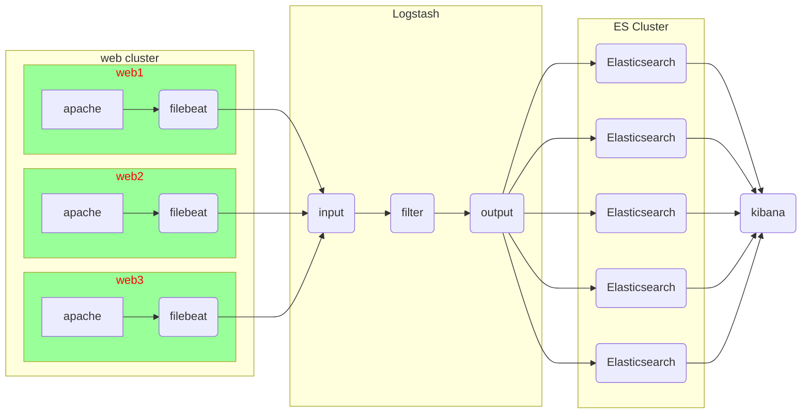

# ELK日志分析平台

## ELK架构图例




#### Elasticsearch 安装

###### 在跳板机上配置 yum 仓库

拷贝云盘 rpm-package/elk 目录到跳板机

```shell
[root@ecs-proxy ~]# cp -a elk /var/ftp/localrepo/elk
[root@ecs-proxy elk]# cd /var/ftp/localrepo/
[root@ecs-proxy localrepo]# createrepo --update .
```

###### 购买云主机 

| 主机    | IP地址       | 配置          |
| ------- | ------------ | ------------- |
| es-0001 | 192.168.1.41 | 最低配置1核1G |
| es-0002 | 192.168.1.42 | 最低配置1核1G |
| es-0003 | 192.168.1.43 | 最低配置1核1G |
| es-0004 | 192.168.1.44 | 最低配置1核1G |
| es-0005 | 192.168.1.45 | 最低配置1核1G |

###### 单机安装

```shell
[root@es-0001 ~]# vim /etc/hosts
192.168.1.41	es-0001
[root@es-0001 ~]# yum install -y java-1.8.0-openjdk elasticsearch
[root@es-0001 ~]# vim /etc/elasticsearch/elasticsearch.yml
54：  network.host: 0.0.0.0
[root@es-0001 ~]# systemctl enable --now elasticsearch
[root@es-0001 ~]# curl http://192.168.1.41:9200/
{
  "name" : "War Eagle",
  "cluster_name" : "elasticsearch",
  "version" : {
    "number" : "2.3.4",
    "build_hash" : "e455fd0c13dceca8dbbdbb1665d068ae55dabe3f",
    "build_timestamp" : "2016-06-30T11:24:31Z",
    "build_snapshot" : false,
    "lucene_version" : "5.5.0"
  },
  "tagline" : "You Know, for Search"
}
```

###### 集群安装

es-0001 ... es-0005 所有主机，都要执行以下操作

```shell
[root@es-0001 ~]# vim /etc/hosts
192.168.1.41	es-0001
192.168.1.42	es-0002
192.168.1.43	es-0003
192.168.1.44	es-0004
192.168.1.45	es-0005
[root@es-0001 ~]# yum install -y java-1.8.0-openjdk elasticsearch
[root@es-0001 ~]# vim /etc/elasticsearch/elasticsearch.yml
17：  cluster.name: my-es
23：  node.name: es-0001 # 本机主机名
54：  network.host: 0.0.0.0
68：  discovery.zen.ping.unicast.hosts: ["es-0001", "es-0002", "es-0003"]
[root@es-0001 ~]# systemctl enable --now elasticsearch
[root@es-0001 ~]# curl http://192.168.1.41:9200/_cluster/health?pretty
{
  "cluster_name" : "my-es",
  "status" : "green",
  "timed_out" : false,
  "number_of_nodes" : 5,
  "number_of_data_nodes" : 5,
   ... ...
}
```

###### 插件安装

拷贝云盘 public/elk 目录到跳板机

```shell
# 本地安装，拷贝 bigdesk 插件文件到 es-0005
[root@es-0005 ~]# /usr/share/elasticsearch/bin/plugin install file:///root/bigdesk-master.zip 
[root@es-0005 ~]# /usr/share/elasticsearch/bin/plugin list
Installed plugins in /usr/share/elasticsearch/plugins:
    - bigdesk
# 远程安装，把插件拷贝到跳板机的ftp目录下
[root@es-0005 ~]# /usr/share/elasticsearch/bin/plugin install ftp://192.168.1.252/public/elk/elasticsearch-kopf-master.zip
[root@es-0005 ~]# /usr/share/elasticsearch/bin/plugin install ftp://192.168.1.252/public/elk/elasticsearch-head-master.zip
[root@es-0005 ~]# /usr/share/elasticsearch/bin/plugin list
Installed plugins in /usr/share/elasticsearch/plugins:
    - head
    - bigdesk
    - kopf
```

访问插件：

1、华为云绑定弹性公网IP给 es-0005 节点

2、http://弹性公网IP:9200/_plugin/插件名称  [bigdesk|head|kopf]

http://公网IP:9200/\_plugin/kopf
http://公网IP:9200/\_plugin/head
http://公网IP:9200/\_plugin/bigdesk

#### Elasticsearch基本操作

###### 查询_cat方法

```shell
# 查询支持的关键字
[root@es-0001 ~]# curl -XGET http://es-0001:9200/_cat/
# 查具体的信息
[root@es-0001 ~]# curl -XGET http://es-0001:9200/_cat/master
# 显示详细信息 ?v
[root@es-0001 ~]# curl -XGET http://es-0001:9200/_cat/master?v
# 显示帮助信息 ?help
[root@es-0001 ~]# curl -XGET http://es-0001:9200/_cat/master?help
```

###### 创建索引

指定索引的名称，指定分片数量，指定副本数量

创建索引使用 PUT 方法，创建完成以后通过 head 插件验证

```shell
[root@es-0001 ~]# curl -XPUT http://es-0001:9200/tedu -d \
'{
    "settings":{
       "index":{
          "number_of_shards": 5, 
          "number_of_replicas": 1
       }
    }
}'
```

###### 增加数据

```shell
[root@es-0001 ~]# curl -XPUT http://es-0001:9200/tedu/teacher/1 -d \
'{
  "职业": "诗人",
  "名字": "李白",
  "称号": "诗仙",
  "年代": "唐"
}' 
```

###### 查询数据

```shell\
[root@es-0001 ~]# curl -XGET http://es-0001:9200/tedu/teacher/1?pretty
```

###### 修改数据

```shell\
[root@es-0001 ~]# curl -XPOST http://es-0001:9200/tedu/teacher/1/_update -d '{ 
    "doc": {
        "年代": "公元701"
    }
}'
```

###### 删除数据

```shell
# 删除一条
[root@es-0001 ~]# curl -XDELETE http://es-0001:9200/tedu/teacher/1
# 删除索引
[root@es-0001 ~]# curl -XDELETE http://es-0001:9200/tedu
# 删除所有
[root@es-0001 ~]# curl -XDELETE http://es-0001:9200/*
```

#### kibana安装

###### 购买云主机 

| 主机   | IP地址       | 配置          |
| ------ | ------------ | ------------- |
| kibana | 192.168.1.46 | 最低配置1核1G |

###### 安装kibana

```shell
[root@kibana ~]# vim /etc/hosts
192.168.1.41	es-0001
192.168.1.42	es-0002
192.168.1.43	es-0003
192.168.1.44	es-0004
192.168.1.45	es-0005
192.168.1.46	kibana
[root@kibana ~]# yum install -y kibana
[root@kibana ~]# vim /opt/kibana/config/kibana.yml
02  server.port: 5601
05  server.host: "0.0.0.0"
15  elasticsearch.url: "http://es-0001:9200"
23  kibana.index: ".kibana"
26  kibana.defaultAppId: "discover"
[root@kibana ~]# systemctl enable --now kibana
```

绑定弹性公网IP，通过 WEB 浏览器验证

http://弹性公网IP:5601/status

###### 导入日志数据

拷贝云盘 public/elk/logs.jsonl.gz 到跳板机

```shell
[root@ecs-proxy ~]# gunzip logs.jsonl.gz 
[root@ecs-proxy ~]# curl -XPOST http://192.168.1.41:9200/_bulk --data-binary @logs.jsonl 
```

