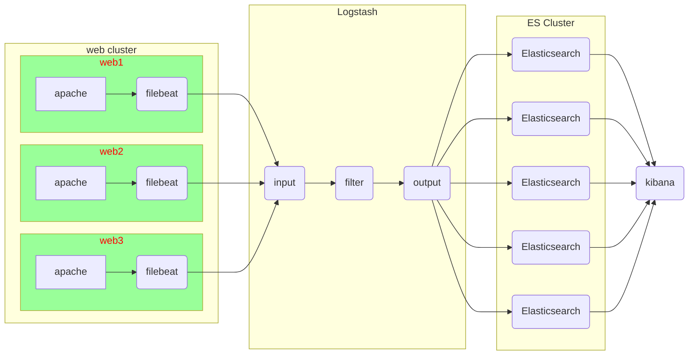

# ELK日志分析平台

## ELK架构图例



#### logstash安装

###### 购买云主机 

| 主机     | IP地址       | 配置          |
| -------- | ------------ | ------------- |
| logstash | 192.168.1.47 | 最低配置2核2G |
| web      | 192.168.1.48 | 最低配置1核1G |

###### web云主机安装

```shell
[root@web ~]# yum install -y httpd
[root@web ~]# systemctl enable --now httpd
[root@web ~]# echo "hello world" >/var/www/html/info.html
[root@web ~]# curl http://192.168.1.48/info.html
```

###### logstash云主机安装

```shell
[root@logstash ~]# vim /etc/hosts
192.168.1.41	es-0001
192.168.1.42	es-0002
192.168.1.43	es-0003
192.168.1.44	es-0004
192.168.1.45	es-0005
192.168.1.47	logstash
[root@logstash ~]# yum install -y java-1.8.0-openjdk logstash
[root@logstash ~]# touch /etc/logstash/logstash.conf
```

###### 基础配置样例

```shell
[root@logstash ~]# vim /etc/logstash/logstash.conf
input { 
  stdin {}
}
filter{ }
output{ 
  stdout{}
}
[root@logstash ~]# /opt/logstash/bin/logstash -f /etc/logstash/logstash.conf
```

###### 插件与调试格式

使用json格式字符串测试  {"a":"1", "b":"2","c":"3"}

```shell
[root@logstash ~]# vim /etc/logstash/logstash.conf
input { 
  stdin { codec => "json" }
}
filter{ }
output{ 
  stdout{ codec => "rubydebug" }
}
[root@logstash ~]# /opt/logstash/bin/logstash -f /etc/logstash/logstash.conf
```

官方手册地址

https://www.elastic.co/guide/en/logstash/current/index.html

###### input file插件

```shell
[root@logstash ~]# vim /etc/logstash/logstash.conf
input { 
  file {
    path => ["/tmp/c.log"]
    type => "test"
    start_position => "beginning"
    sincedb_path => "/var/lib/logstash/sincedb"
  }
}
filter{ }
output{ 
  stdout{ codec => "rubydebug" }
}
[root@logstash ~]# rm -rf /root/.sincedb_*
[root@logstash ~]# /opt/logstash/bin/logstash -f /etc/logstash/logstash.conf
```

###### filter grok插件

正则表达式分组匹配格式: (?<名字>正则表达式)

正则表达式宏调用格式:     %{宏名称:名字}

宏文件路径 

/opt/logstash/vendor/bundle/jruby/1.9/gems/logstash-patterns-core-2.0.5/patterns/grok-patterns

```shell
[root@logstash ~]# echo '192.168.1.252 - - [29/Jul/2020:14:06:57 +0800] "GET /info.html HTTP/1.1" 200 119 "-" "curl/7.29.0"' >/tmp/c.log
[root@logstash ~]# vim /etc/logstash/logstash.conf
input { 
  file {
    path => ["/tmp/c.log"]
    type => "test"
    start_position => "beginning"
    sincedb_path => "/dev/null"
  }
}
filter{ 
  grok {
    match => { "message" => "%{COMBINEDAPACHELOG}" }
  }
}
output{ 
  stdout{ codec => "rubydebug" }
}
[root@logstash ~]# /opt/logstash/bin/logstash -f /etc/logstash/logstash.conf
```

###### output elasticsearch插件

```shell
[root@logstash ~]# vim /etc/logstash/logstash.conf
input { 
  file {
    path => ["/tmp/c.log"]
    type => "test"
    start_position => "beginning"
    sincedb_path => "/dev/null"
  }
}
filter{ 
  grok {
    match => { "message" => "%{COMBINEDAPACHELOG}" }
  }
}
output{ 
  stdout{ codec => "rubydebug" }
  elasticsearch {
    hosts => ["es-0001:9200", "es-0002:9200", "es-0003:9200"]
    index => "weblog"
  }
}
[root@logstash ~]# curl -XDELETE http://es-0001:9200/*
[root@logstash ~]# /opt/logstash/bin/logstash -f /etc/logstash/logstash.conf
```

浏览器打开 head 插件，通过 web 页面浏览验证
http://公网IP:9200/_plugin/head/

#### filebeat配置

###### web服务安装filebeat

```shell
[root@web ~]# yum install -y filebeat
[root@web ~]# vim /etc/filebeat/filebeat.yml
15:    - /var/log/httpd/access_log
72:    document_type: apache_log
183:  #注释掉该行
188:   #注释掉该行
278： logstash:
280：   hosts: ["192.168.1.47:5044"]
[root@web ~]# grep -Pv "^\s*(#|$)" /etc/filebeat/filebeat.yml
[root@web ~]# systemctl enable --now filebeat
```

###### logstash beats插件

```shell
[root@logstash ~]# vim /etc/logstash/logstash.conf
input { 
  file {
    path => ["/tmp/c.log"]
    type => "test"
    start_position => "beginning"
    sincedb_path => "/var/lib/logstash/sincedb"
  }
  beats {
    port => 5044
  }
}
filter{ 
  grok {
    match => { "message" => "%{COMBINEDAPACHELOG}" }
  }
}
output{ 
  stdout{ codec => "rubydebug" }
  elasticsearch {
    hosts => ["es-0001:9200", "es-0002:9200", "es-0003:9200"]
    index => "weblog"
  }
}
[root@logstash ~]# /opt/logstash/bin/logstash -f /etc/logstash/logstash.conf
```

访问 web 页面，浏览器打开 head 插件，通过 web 页面浏览验证

#### 网站日志分析实战

1、停止 kibana 服务
```shell
[root@kibana ~]# systemctl stop kibana
```
2、清空 elasticsearch 中所有数据 

```shell
[root@kibana ~]# curl -XDELETE http://es-0001:9200/*
```
3、配置 web 日志，获取用户真实IP
   通过 ELB 把 web 服务发布公网
   https://support.huaweicloud.com/elb_faq/elb_faq_0090.html

```shell\
[root@web ~]# vim /etc/httpd/conf/httpd.conf
#57 行新添加
RemoteIPHeader X-Forwarded-For
RemoteIPInternalProxy 100.125.0.0/16
# 修改 198 行
    LogFormat "%a %l %u %t \"%r\" %>s %b \"%{Referer}i\" \"%{User-Agent}i\"" combined
[root@web ~]# systemctl restart httpd
```

4、配置 filebeat
   详见配置文件 filebeat.yml
   重启服务

```shell
[root@web ~]# systemctl restart filebeat
```
5、配置 logstash
   详见配置文件 logstash.conf
   启动服务

```shell
[root@logstash ~]# /opt/logstash/bin/logstash -f /etc/logstash/logstash.conf
```
6、配置 kibana
   启动服务，通过web页面配置 kibana

```shell
[root@kibana ~]# systemctl start kibana
```

###### 常见错误

使用通配符删除报错

```shell
[root@es-0001 ~]# curl -XDELETE http://localhost:9200/*
{"error":{"root_cause":[{"type":"illegal_argument_exception","reason":"Wildcard expressions or all indices are not allowed"}],"type":"illegal_argument_exception","reason":"Wildcard expressions or all indices are not allowed"},"status":400}
# 由于设置了destructive_requires_name 参数，不允许使用通配符
# 查看及解决方式
[root@es-0001 ~]# curl -XGET http://es-0001:9200/_cluster/settings?pretty
{
  "persistent" : {
    "action" : {
      "destructive_requires_name" : "true"
    }
  },
  "transient" : { }
}
[root@es-0001 ~]# curl -XPUT http://localhost:9200/_cluster/settings -d '
{
  "persistent": {
      "action": {
        "destructive_requires_name": "true"
      }
   }
}'
[root@es-0001 ~]# curl -XDELETE http://localhost:9200/*
{"acknowledged":true}
```

